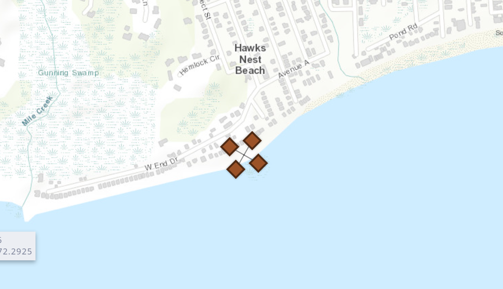

# Environment Setup, Tools/Platforms, and Dataset Documentation

This document is a brief guide to help users set up the required environment, utilize the tools and platforms utilized, and understand the datasets in this project. 

## Table of Contents
- [Environment Setup](#environment-setup)
    - [Creating the environment from the environment.yml](#setting-up-the-environment-from-the-environmentyml)
    - [Google Earth Engine Setup](#google-earth-engine-setup)
- [Tools and Platforms](#tools-and-platforms)
- [Dataset Documentation](#dataset-documentation)
    - [STN high-water marks](#stn-high-water-marks)
        - [Dataset overview](#hwm-dataset-overview)
        - [Date selection](#date-selection-date_threshold)
        - [Area of interest selection](#area-of-interest-selection-area_list)
        - [Duplicates check](#duplicates-check-latitude-longitude-and-event)
    - [High-water levels from gauges](#high-water-levels-from-gauges)
        - [Dataset overview](#hwl-dataset-overview)

## Environment Setup
### Setting up the environment from the environment.yml
1. use the terminal to create the environment from the environment.yml:
```
conda env create -f environment.yml
```

2. activate the environment (the environment's name can be found in the yml file):
```
conda activate flood
```

### Google Earth Engine Setup
Google Earth Engine has a guide about [setting up Earth Engine enabled Cloud Project](https://developers.google.com/earth-engine/cloud/earthengine_cloud_project_setup). Below is a step-by-step demonstration of the approach I selected to use Google Earth Engine.

#### step 1 - create a cloud project
Create a Google Cloud Project using this [link](https://console.cloud.google.com/projectcreate) or clicking on the link in the official setup guide. 


#### step 2 - enable the Earth Engine API
To enable the Earth Engine API, click on the link (Enable the Earth Engine API) in the offical setup guide or search for Earth Engine API in APIs & Services section. 


To enable this API, setting up the credentials is required. If credentials are not set up, a warning will appear after you click the Enable button. 


Clicking on the CREATE CREDENTIALS button, we'll move to the section of creating credentials. 


#### step 3 - register Earth Engine
To use Earth Engine, we need to register the project [here](https://code.earthengine.google.com/register). 


#### step 4 - fetch credentials using gcloud
When running `make s2`, you will receive the following output:


1. create a Cloud project named flood-demo:
2. create credentials before using Google Earth Engine API:
3. enable Google Earth Engine API in APIs & Services:
4. enter authorization code when running `make s2` for the first time:

## Tools and Platforms

## Dataset Documentation

### [STN high-water marks](https://stn.wim.usgs.gov/STNDataPortal/)
The USGS Short-Term Network (STN) Flood Event Data Portal includes high-water mark data which is the evidence of a flood event. USGS also provide an interactive website called [Flood Event Viewer](https://stn.wim.usgs.gov/FEV/) to explore the flood events. To understand more about high-water mark and its importance, we can check [High-Water Marks and Flooding](https://www.usgs.gov/special-topics/water-science-school/science/high-water-marks-and-flooding) and [A USGS guide for finding and interpreting high-water marks](https://www.youtube.com/watch?v=uZYRQLMcVOA).

#### HWM dataset overview
In this project, the downloaded original dataset (53 x 3502) has 53 attributes:
```
high water marks dataset attributes:
 ['latitude', 'longitude', 'eventName', 'hwmTypeName', 'hwmQualityName', 'verticalDatumName', 'verticalMethodName', 'approvalMember', 'markerName', 'horizontalMethodName', 'horizontalDatumName', 'flagMemberName', 'surveyMemberName', 'site_no', 'siteDescription', 'sitePriorityName', 'networkNames', 'stateName', 'countyName', 'siteZone', 'sitePermHousing', 'site_latitude', 'site_longitude', 'hwm_id', 'waterbody', 'site_id', 'event_id', 'hwm_type_id', 'hwm_quality_id', 'latitude_dd', 'longitude_dd', 'survey_date', 'elev_ft', 'vdatum_id', 'vcollect_method_id', 'bank', 'marker_id', 'hcollect_method_id', 'hwm_environment', 'flag_date', 'stillwater', 'hdatum_id', 'hwm_label', 'files', 'hwm_notes', 'hwm_locationdescription', 'height_above_gnd', 'flag_member_id', 'survey_member_id', 'uncertainty', 'hwm_uncertainty', 'approval_id', 'peak_summary_id']
```

The preprocessed dataset (8 x 889) has 8 attributes (7 from the original dataset and 1 created during preprocessing):
- `id` (formerly `hwm_id`) - a unique identifier for each high-water mark
- `event` (formerly `eventName`) - the category of the flood event
- `latitude` and `longitude` - the geographical coordinates of each high-water mark
- `state` and `county` (formerly `stateName` and `countyName`) - the state and county where each high-water mark is located
- `note` (formerly `hwm_locationdescription`) - a comment or description related to the high-water mark
- `source`: a newly created label to identify the source of each high-water mark

#### Date selection `date_threshold`
The flood events in original STN dataset include:
```
['2021 Henri', '2012 Sandy', '2018 March Extratropical Cyclone', '2010 March - April RI MA Flood', '1978 Feb Extratropical Cyclone', '1991 October Extratropical Cyclone', '2018 January Extratropical Cyclone', '2011 Irene', '2023 July MA NY VT Flood', '2023 December East Coast Cyclone']
```

However, the selected satellite is [Sentinel-2](https://developers.google.com/earth-engine/datasets/catalog/sentinel-2). Sentinel-2 (Level-1C) was launched in 2015. As a result, high-water marks before 2015 will not be included. Additionally, based on the previous output, the earliest flood event after 2015 occurred in 2018. Therefore, we can set the date threshold to 2017. This allows us to utilize the more precise Sentinel-2 Level-2A dataset, which has been available since March 28, 2017. This date (2017-03-28) will be used when collecting high-water levels.

#### Area of Interest selection `area_list`
The area of interest is the New England Region, including Connecticut, Maine, Massachusetts, New Hampshire, Rhode Island, and Vermont. Initially, the focus was on Maine; however, due to the limited availability of recent flood event observations when Sentinel-2 data became accessible, the focus shifted. Under the guidance of Samuel Roy, a USGS scientist, the area of interest was expanded to include other states with potentially similar flood characteristics, particularly Vermont. Other states in the New England Region are also being considered.

#### Duplicates check `latitude`, `longitude`, and `event`
Firstly, around 200 observations were removed due to duplicates after dropping the `files` attribute representing high-water mark files (primarily photos). These files can be viewed on the [STN Flood Event Viewer](https://stn.wim.usgs.gov/FEV/#2023JulyMANYVTFlood), but cannot be downloaded directly using `requests`. 

Secondly, approximately 2,400 observations were removed due to duplicate combinations of `latitude`, `longitude`, and `event`. A key task in using STN high-water marks is to retrieve corresponding satellite images based on the location and date of the high-water marks. Therefore, it's crucial to avoid collecting duplicate locations for the same flood event.

Also, further exploration of the duplicates in `latitude`, `longitude`, and `event` revealed that a single location might have multiple high-water marks with different elevation values. Below is the first 4 rows of duplicate values:
```
duplicates in ['event', 'latitude', 'longitude']:
          id       event state      county   latitude  longitude                                               note source
0     40933  2021 Henri    CT   Middlesex  41.281522 -72.283981                                                NaN    stn
1     40934  2021 Henri    CT   Middlesex  41.281522 -72.283981                                                NaN    stn
2     40935  2021 Henri    CT   Middlesex  41.281522 -72.283981                                                NaN    stn
3     40936  2021 Henri    CT   Middlesex  41.281522 -72.283981                                                NaN    stn
```

The first four high-water marks has the same `event`, `latitude`, and `longitude`. Below is the difference between the first four  rows after examining these high-water marks in the original dataset:
```
difference between id 40933 and id 40934:
          self  other
hwm_id  40933  40934
difference between id 40933 and id 40935:
                     self                                              other
hwm_id             40933                                              40935
elev_ft            4.024                                              3.641
hwm_environment  Coastal                                           Riverine
hwm_label           HWM1                                               HWM2
hwm_notes            NaN  not sure if one mark is more reliable than the...
difference between id 40933 and id 40936:
                     self                                              other
hwm_id             40933                                              40936
elev_ft            4.024                                              3.641
hwm_environment  Coastal                                           Riverine
hwm_label           HWM1                                               HWM2
hwm_notes            NaN  not sure if one mark is more reliable than the...
difference between id 40934 and id 40935:
                     self                                              other
hwm_id             40934                                              40935
elev_ft            4.024                                              3.641
hwm_environment  Coastal                                           Riverine
hwm_label           HWM1                                               HWM2
hwm_notes            NaN  not sure if one mark is more reliable than the...
difference between id 40934 and id 40936:
                     self                                              other
hwm_id             40934                                              40936
elev_ft            4.024                                              3.641
hwm_environment  Coastal                                           Riverine
hwm_label           HWM1                                               HWM2
hwm_notes            NaN  not sure if one mark is more reliable than the...
difference between id 40935 and id 40936:
          self  other
hwm_id  40935  40936
```

These high-water marks can also be examined from the [visualization on Flood Event Viewer](https://stn.wim.usgs.gov/FEV/#2021Henri):



### High-water levels from gauges
High-water levels from gauges are collected and preprocessed using four steps:
- collect NWSLI identifiers and descriptions for the gauges from NOAA;
- identify the corresponding usgsid for each gauge and gather flood-related information, including flood stage thresholds and flood impacts;
- collect real-time water levels using usgsid and compare them against the flood stage thresholds to identify observations where levels exceed the moderate flood stage (2017-03-28 to 2024-05-23);
- preprocess the collected high-water levels by selecting the specified attributes, assigning the source (gauge), and creating a `event` attribute to group the high-water levels by YYYY-MM.


Exemplar:
1. [ME gauge list](https://hads.ncep.noaa.gov/charts/ME.shtml);
2. [Flood-related Information - Kennecbec River at Augusta Information with NWSLI ASTM1](https://water.noaa.gov/gauges/ASTM1);
3. [Water Levels - Kennebec River at Augusta with NWSLI ASTM1 and USGSID 01049320](https://waterdata.usgs.gov/monitoring-location/01049320/#parameterCode=00065&period=P7D&showMedian=false) and constructed [URL to retrieve data between 2017-03-28 and 2018-05-23](https://nwis.waterservices.usgs.gov/nwis/iv/?sites=01049320&parameterCd=00065&startDT=2017-03-28T00:00:00.000-05:00&endDT=2018-05-23T23:59:59.999-04:00&siteStatus=all&format=rdb) (shorter date range for demonstration only).

#### HWL dataset overview
The first dataset `df_gauge_list` represents the gauges (names and nswli identifiers) in the New England Region. This dataset (3 x 515) has 3 attributes:
```
gauge list dataset attributes:
 ['nwsli', 'description', 'state']
```

The second dataset `df_gauge_info` represents the gauge metadata, specially flood-related information. This dataset (10 x 154) has 10 attributes:
```
Guage info dataset attributes:
 ['usgsid', 'nwsli', 'latitude', 'longitude', 'state', 'county', 'minor', 'moderate', 'major', 'floodimpacts']
```

The third dataset `df_gauge_raw` represents the real-time water levels above moderate flood stages. This dataset (11 x 218) has 11 attributes:
```
gauge high-water levels dataset attributes:
 ['usgsid', 'event_day', 'tz_cd', 'elev_ft', 'latitude', 'longitude', 'nwsli', 'note', 'state', 'county', 'id']
```

The last dataset `df_gauge_mod` represents the preprocessed dataset. This dataset (9 x 218) has 9 attributes (7 from the original dataset and 2 created during preprocessing):
- `id` - a unique identifier for each high-water level (nwsli + index)
- `event` - the created category of the flood event (YYYY-MM)
- `event_day` - the date of the high-water level (YYYY-MM-DD)
- `latitude` and `longitude` - the geographical coordinates of each high-water level
- `state` and `county` (formerly `stateName` and `countyName`) - the state and county where each high-water level is located
- `note` - the flood impact of different water level
- `source`: a newly created label to identify the source of each high-water levels

### [National Hydrography Dataset](https://www.usgs.gov/national-hydrography)
The ZIP file for a state's NHD dataset includes the following contents:
```
list all contents within the ZIP file for Vermont
['Shape/ExternalCrosswalk.dbf', 'Shape/NHDArea.dbf', 'Shape/NHDArea.prj', 'Shape/NHDArea.shp', 'Shape/NHDArea.shx', 'Shape/NHDAreaEventFC.dbf', 'Shape/NHDAreaEventFC.prj', 'Shape/NHDAreaEventFC.shp', 'Shape/NHDAreaEventFC.shx', 'Shape/NHDFCode.dbf', 'Shape/NHDFeatureToMetadata.dbf', 'Shape/NHDFlow.dbf', 'Shape/NHDFlowline.dbf', 'Shape/NHDFlowline.prj', 'Shape/NHDFlowline.shp', 'Shape/NHDFlowline.shx', 'Shape/NHDFlowlineVAA.dbf', 'Shape/NHDLine.dbf', 'Shape/NHDLine.prj', 'Shape/NHDLine.shp', 'Shape/NHDLine.shx', 'Shape/NHDLineEventFC.dbf', 'Shape/NHDLineEventFC.prj', 'Shape/NHDLineEventFC.shp', 'Shape/NHDLineEventFC.shx', 'Shape/NHDMetadata.dbf', 'Shape/NHDPoint.dbf', 'Shape/NHDPoint.prj', 'Shape/NHDPoint.shp', 'Shape/NHDPoint.shx', 'Shape/NHDPointEventFC.dbf', 'Shape/NHDPointEventFC.prj', 'Shape/NHDPointEventFC.shp', 'Shape/NHDPointEventFC.shx', 'Shape/NHDProcessingParameters.dbf', 'Shape/NHDReachCodeMaintenance.dbf', 'Shape/NHDReachCrossReference.dbf', 'Shape/NHDSourceCitation.dbf', 'Shape/NHDStatus.dbf', 'Shape/NHDVerticalRelationship.dbf', 'Shape/NHDWaterbody.dbf', 'Shape/NHDWaterbody.prj', 'Shape/NHDWaterbody.shp', 'Shape/NHDWaterbody.shx', 'Shape/WBDHU10.dbf', 'Shape/WBDHU10.prj', 'Shape/WBDHU10.shp', 'Shape/WBDHU10.shx', 'Shape/WBDHU12.dbf', 'Shape/WBDHU12.prj', 'Shape/WBDHU12.shp', 'Shape/WBDHU12.shx', 'Shape/WBDHU14.dbf', 'Shape/WBDHU14.prj', 'Shape/WBDHU14.shp', 'Shape/WBDHU14.shx', 'Shape/WBDHU16.dbf', 'Shape/WBDHU16.prj', 'Shape/WBDHU16.shp', 'Shape/WBDHU16.shx', 'Shape/WBDHU2.dbf', 'Shape/WBDHU2.prj', 'Shape/WBDHU2.shp', 'Shape/WBDHU2.shx', 'Shape/WBDHU4.dbf', 'Shape/WBDHU4.prj', 'Shape/WBDHU4.shp', 'Shape/WBDHU4.shx', 'Shape/WBDHU6.dbf', 'Shape/WBDHU6.prj', 'Shape/WBDHU6.shp', 'Shape/WBDHU6.shx', 'Shape/WBDHU8.dbf', 'Shape/WBDHU8.prj', 'Shape/WBDHU8.shp', 'Shape/WBDHU8.shx', 'Shape/WBDLine.dbf', 'Shape/WBDLine.prj', 'Shape/WBDLine.shp', 'Shape/WBDLine.shx', 'NHD_H_Vermont_State_Shape.xml', 'NHD_H_Vermont_State_Shape.jpg']
```

The selected contents for this project are 'Shape/NHDFlowline.shp', 'Shape/NHDFlowline.shx', 'Shape/NHDFlowline.dbf', 'Shape/NHDFlowline.prj', 'Shape/NHDFlowlineVAA.dbf'. Below is an brief description of each content. As for the detailed documentation, users can visit the [NHD documentation](https://d9-wret.s3.us-west-2.amazonaws.com/assets/palladium/production/s3fs-public/atoms/files/NHD%20v2.3%20Model%20Poster%2006012020.pdf).
- 'Shape/NHDFlowline.shp': represents the geometries;
- 'Shape/NHDFlowline.shx': links .dbf with .shp using index data;
- 'Shape/NHDFlowline.dbf': represents the attribute data about the geometries;
- 'Shape/NHDFlowline.prj': represents the coordinate system and projection information.
