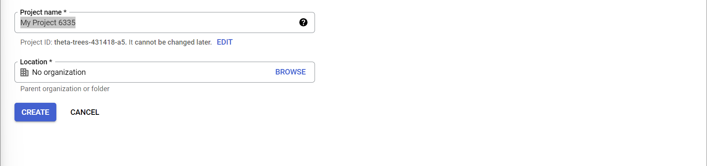
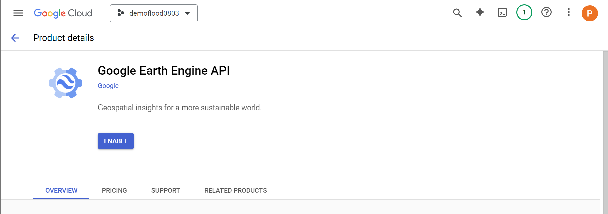
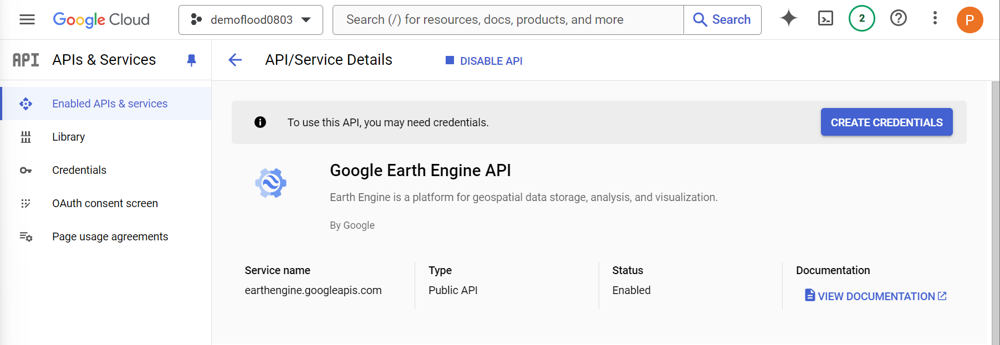
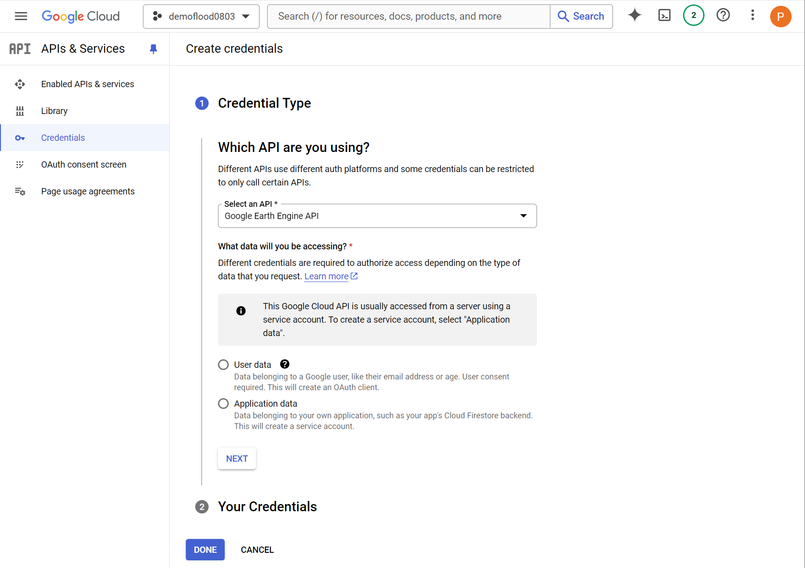
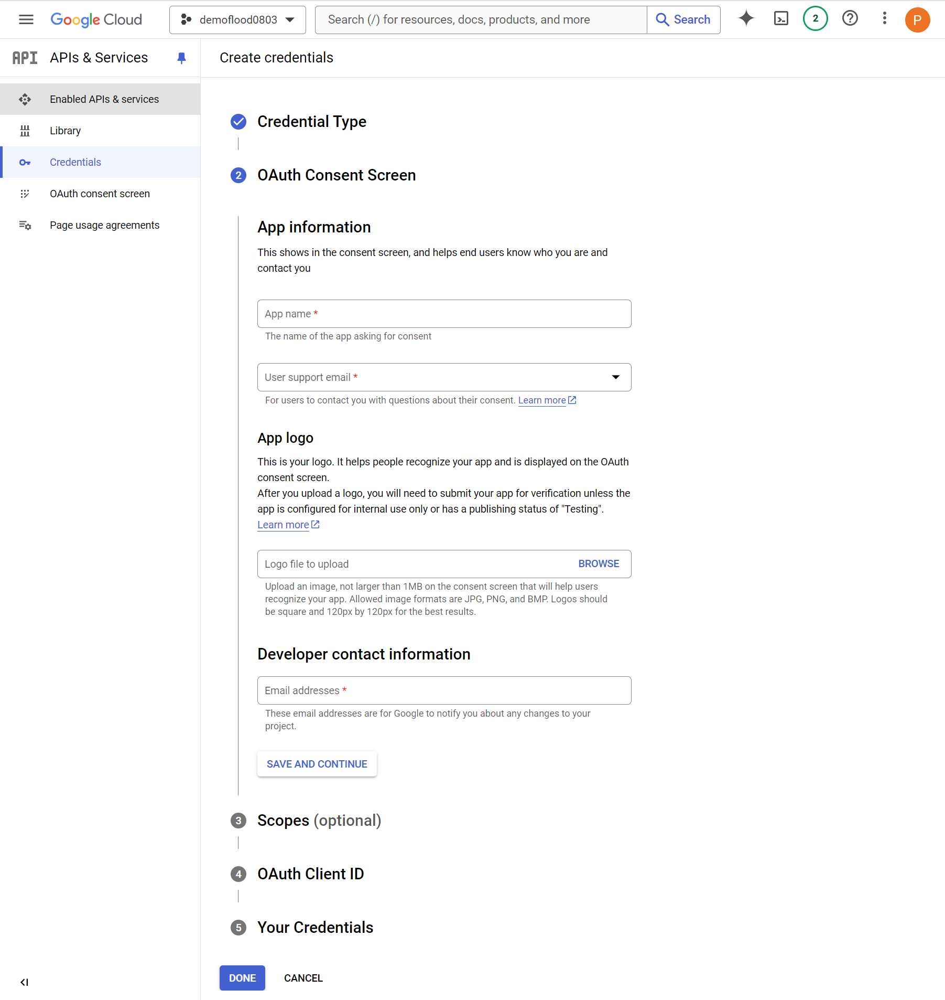
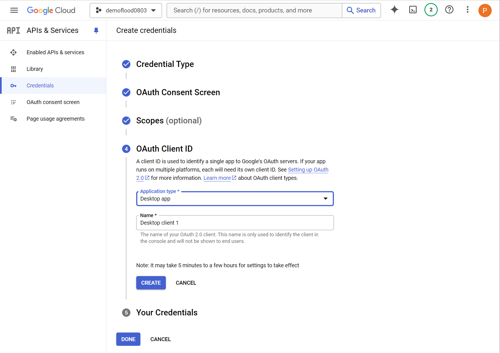
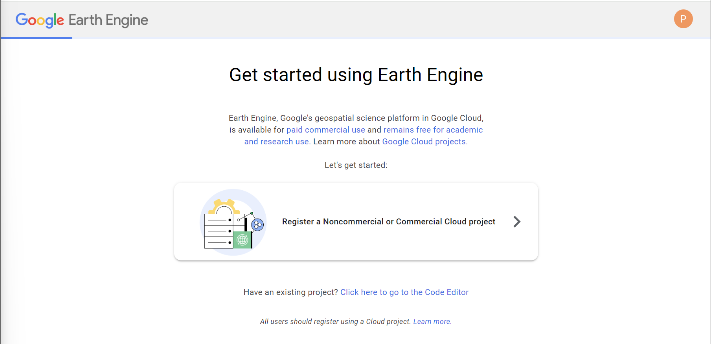
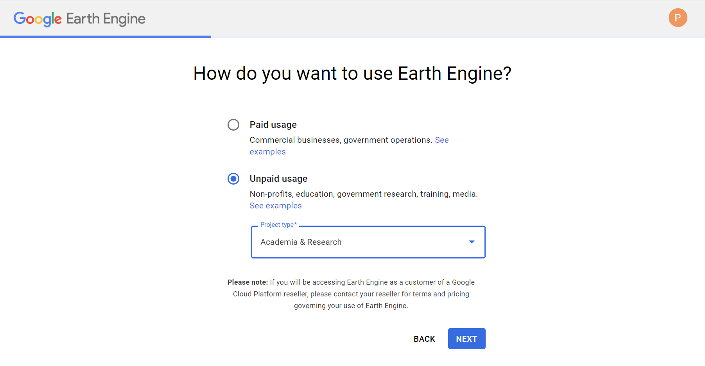
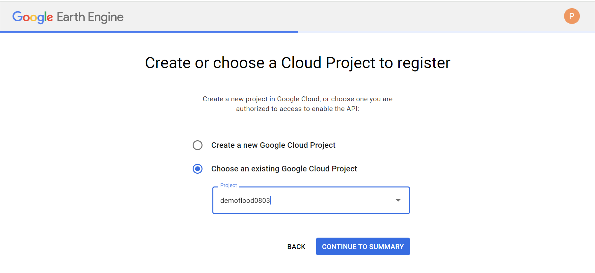
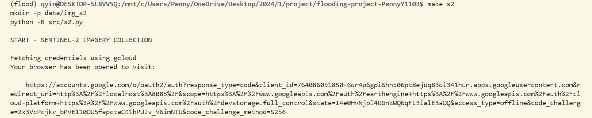

# Environment Setup, Tools/Platforms, and Dataset Documentation

This document is a brief guide to help users set up the required environment, utilize the tools and platforms utilized, and understand the datasets in this project. 

## Table of Contents
- [Environment Setup](#environment-setup)
    - [Creating the environment from the environment.yml](#setting-up-the-environment-from-the-environmentyml)
    - [Google Earth Engine Setup](#google-earth-engine-setup)
- [Tools and Platforms](#tools-and-platforms)
- [Dataset Documentation](#dataset-documentation)

## Environment Setup
### Setting up the environment from the environment.yml
1. use the terminal to create the environment from the environment.yml:
```
conda env create -f environment.yml
```

2. activate the environment (the environment's name can be found in the yml file):
```
conda activate flood
```

### Google Earth Engine Setup
Google Earth Engine has a guide about [setting up Earth Engine enabled Cloud Project](https://developers.google.com/earth-engine/cloud/earthengine_cloud_project_setup). Below is a step-by-step demonstration of the approach I selected to use Google Earth Engine.

#### step 1 - create a cloud project
We can create a Google Cloud Project using this [link](https://console.cloud.google.com/projectcreate) or clicking on the button in the official setup guide. 

#### step 2 - enable the Earth Engine API
To enable the Earth Engine API, we can click on the button (Enable the Earth Engine API) in the offical setup guide or search for Earth Engine API in APIs & Services section. 

To use this API, we may need credentials. If you haven't done so, you will see a warning after clicking on the Enable button. 

Clicking on the CREATE CREDENTIALS button, we'll move to the section of creating credentials. 



#### step 3 - register Earth Engine
To use Earth Engine, we need to register the project [here](https://code.earthengine.google.com/register). 



#### step 4 - fetch credentials using gcloud
When running `make s2`, you will receive the following output:



1. create a Cloud project named flood-demo:
2. create credentials before using Google Earth Engine API:
3. enable Google Earth Engine API in APIs & Services:
4. enter authorization code when running `make s2` for the first time:

## Tools and Platforms

## Dataset Documentation
### [National Hydrography Dataset](https://www.usgs.gov/national-hydrography)
The ZIP file for a state's NHD dataset includes the following contents:
```
list all contents within the ZIP file for Vermont
['Shape/ExternalCrosswalk.dbf', 'Shape/NHDArea.dbf', 'Shape/NHDArea.prj', 'Shape/NHDArea.shp', 'Shape/NHDArea.shx', 'Shape/NHDAreaEventFC.dbf', 'Shape/NHDAreaEventFC.prj', 'Shape/NHDAreaEventFC.shp', 'Shape/NHDAreaEventFC.shx', 'Shape/NHDFCode.dbf', 'Shape/NHDFeatureToMetadata.dbf', 'Shape/NHDFlow.dbf', 'Shape/NHDFlowline.dbf', 'Shape/NHDFlowline.prj', 'Shape/NHDFlowline.shp', 'Shape/NHDFlowline.shx', 'Shape/NHDFlowlineVAA.dbf', 'Shape/NHDLine.dbf', 'Shape/NHDLine.prj', 'Shape/NHDLine.shp', 'Shape/NHDLine.shx', 'Shape/NHDLineEventFC.dbf', 'Shape/NHDLineEventFC.prj', 'Shape/NHDLineEventFC.shp', 'Shape/NHDLineEventFC.shx', 'Shape/NHDMetadata.dbf', 'Shape/NHDPoint.dbf', 'Shape/NHDPoint.prj', 'Shape/NHDPoint.shp', 'Shape/NHDPoint.shx', 'Shape/NHDPointEventFC.dbf', 'Shape/NHDPointEventFC.prj', 'Shape/NHDPointEventFC.shp', 'Shape/NHDPointEventFC.shx', 'Shape/NHDProcessingParameters.dbf', 'Shape/NHDReachCodeMaintenance.dbf', 'Shape/NHDReachCrossReference.dbf', 'Shape/NHDSourceCitation.dbf', 'Shape/NHDStatus.dbf', 'Shape/NHDVerticalRelationship.dbf', 'Shape/NHDWaterbody.dbf', 'Shape/NHDWaterbody.prj', 'Shape/NHDWaterbody.shp', 'Shape/NHDWaterbody.shx', 'Shape/WBDHU10.dbf', 'Shape/WBDHU10.prj', 'Shape/WBDHU10.shp', 'Shape/WBDHU10.shx', 'Shape/WBDHU12.dbf', 'Shape/WBDHU12.prj', 'Shape/WBDHU12.shp', 'Shape/WBDHU12.shx', 'Shape/WBDHU14.dbf', 'Shape/WBDHU14.prj', 'Shape/WBDHU14.shp', 'Shape/WBDHU14.shx', 'Shape/WBDHU16.dbf', 'Shape/WBDHU16.prj', 'Shape/WBDHU16.shp', 'Shape/WBDHU16.shx', 'Shape/WBDHU2.dbf', 'Shape/WBDHU2.prj', 'Shape/WBDHU2.shp', 'Shape/WBDHU2.shx', 'Shape/WBDHU4.dbf', 'Shape/WBDHU4.prj', 'Shape/WBDHU4.shp', 'Shape/WBDHU4.shx', 'Shape/WBDHU6.dbf', 'Shape/WBDHU6.prj', 'Shape/WBDHU6.shp', 'Shape/WBDHU6.shx', 'Shape/WBDHU8.dbf', 'Shape/WBDHU8.prj', 'Shape/WBDHU8.shp', 'Shape/WBDHU8.shx', 'Shape/WBDLine.dbf', 'Shape/WBDLine.prj', 'Shape/WBDLine.shp', 'Shape/WBDLine.shx', 'NHD_H_Vermont_State_Shape.xml', 'NHD_H_Vermont_State_Shape.jpg']
```

The selected contents for this project are 'Shape/NHDFlowline.shp', 'Shape/NHDFlowline.shx', 'Shape/NHDFlowline.dbf', 'Shape/NHDFlowline.prj', 'Shape/NHDFlowlineVAA.dbf'. Below is an brief description of each content. As for the detailed documentation, users can visit the [NHD documentation](https://d9-wret.s3.us-west-2.amazonaws.com/assets/palladium/production/s3fs-public/atoms/files/NHD%20v2.3%20Model%20Poster%2006012020.pdf).
- 'Shape/NHDFlowline.shp': represents the geometries;
- 'Shape/NHDFlowline.shx': links .dbf with .shp using index data;
- 'Shape/NHDFlowline.dbf': represents the attribute data about the geometries;
- 'Shape/NHDFlowline.prj': represents the coordinate system and projection information.
