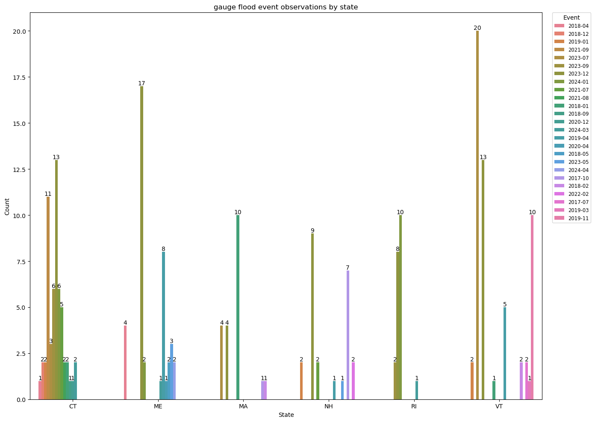
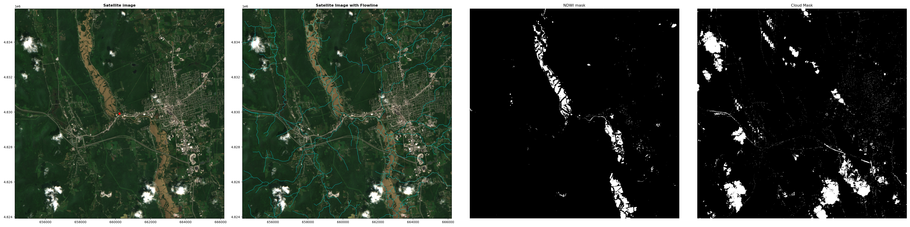
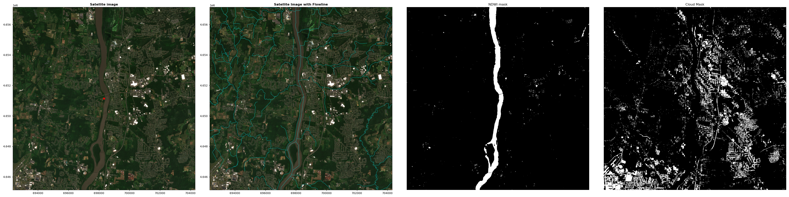

# Report
This document includes the analysis and discussion about flood event data and satellite imagery data.

## Flood Event Data

### STN
The cleaned STN high-water marks has 889 instances. Below is an overview of the attributes in this dataset.
```
count of unique values in each attribute (not list or np.ndarray):
id           889
event          5
state          6
county        28
latitude     863
longitude    860
note         837
source         1
```

This dataset includes five unique flood events. They're `2018 January Extratropical Cyclone`, `2018 March Extratropical Cyclone`, `2021 Henri`,`2023 July MA NY VT Flood`, and `2023 December East Coast Cyclone`. Below are the top three counts of flood event observations group by event(or state) and a `countplot`. 
- The `2023 July MA NY VT Flood` event has a significantly higher number of flood event compared to the `2018 March Extratropical Cyclone` and the `2018 January Extratropical Cyclone`;
- `VT` has a significantly higher number of flood event compared to the `MA` and the `CT`.
- Based on the print out result and the figure, Vermont (2023 July MA NY VT Flood) has the largest number of flood events, indicating that the majority of the analysis will be from here. 

```
print the top three counts of flood event observations group by event...

                                    total_count
event
2023 July MA NY VT Flood                    641
2018 March Extratropical Cyclone            115
2018 January Extratropical Cyclone           81
```

```
print the top three counts of flood event observations group by state...

       total_count
state
VT             646
MA             282
CT              72
```


This dataset doesn't specify the exact dates of these flood event. However, to collect and distinguish the satellite imagery before/during/after flood events, it's necessary to obtain more accurate dates. Therefore, I explored online reports to define the dates and understand how the flood events affected the New England Region. Below is a table summarizing the information from the online reports.
| Event | Date | Impact | Affected State |
|-------|------|--------|----------------|
| [2018 January Extratropical Cyclone](https://en.wikipedia.org/wiki/January_2018_North_American_blizzard) | 2018-01-02 (formed) - 2018-01-06 (dissipated) | | |
| [2018 March Extratropical Cyclone](https://en.wikipedia.org/wiki/March_1%E2%80%933,_2018_nor%27easter) | 2018-03-01 (formed) - 2018-03-05 (dissipated) | | |
| [2021 Henri](https://www.nhc.noaa.gov/data/tcr/AL082021_Henri.pdf) | 2021-08-15 (formed) - 2021-08-23 (dissipated) | | |
| [2023 July MA NY VT Flood](https://www.weather.gov/btv/The-Great-Vermont-Flood-of-10-11-July-2023-Preliminary-Meteorological-Summary) | 2023-07-10 (formed) - 2023-07-11 (dissipated) | | |
| [2023 December East Coast Cyclone](https://cw3e.ucsd.edu/wp-content/uploads/2023/12/20Dec2023_Summary/20231218EastCoast.pdf) | 2023-12-17 (formed) - 2023-12-18 (dissipated) | | |

### Gauge
In this project, I also collected the gauge water level data. Combining this dataset with STN dataset might help us better analyze and understand the flood events. Below is an overview of the cleaned dataset.

```
count of unique values in each attribute (not list or np.ndarray):
 id           218
event         25
event_day     83
state          6
county        34
latitude      68
longitude     68
note          60
source         1
```

```
print the top three counts of flood event observations group by event...

         total_count
event
2023-12           64
2023-07           27
2024-01           18
```

```
print the top three counts of flood event observations group by state...

       total_count
state
CT              57
VT              56
ME              40
```


### STN and Gauge

To understand the locations of flood events, I created a map for each state. Based on the previous examination on STN and Gauge flood event, Vermont (2023 July MA NY VT Flood) should include majority of data point. Below is the flood events in Vermont.


## National Hydrography Dataset and NDWI 
To enhance the analysis of Sentinel-2 images and help improve the performance on KMeans clustering algorithms, the flowlines from National Hydrography Dataset are collected. The command `make nhd` plots the flowlines on the filtered Sentinel-2 image dataset (25 images during flood events). Below is an example of plotting the NHD flowline on top of one Sentinel-2 image.
### 44909


### TMVC3_1890

- In this figure, the added flowlines help distinguish the flooded area, especially in the regions where the land cover is similar to the flood-affected areas. 

### NDWI threshold testing on 44909


## Satellite Imagery Data (Sentinel 2)
In this section, I added the results for two flood event observations.

### 44909
Below is the plotted figure before optimization.


Below is the plotted figure after optimization (pca).


Below is the plotted figure after optimization (ndwi as feature and pca). 


### TMVC3_1890
Below is the plotted figure before optimization.


Below is the plotted figure after optimization (pca).


Below is the plotted figure after optimization (ndwi as feature and pca). 
