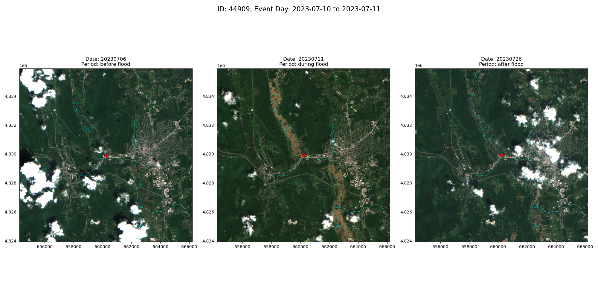

# Report
This project focus on developing an algorithm for automated assessment of inland flooding from satellite observations. Specifically, this algorithm collects satellite images corresponding to before-, during-, and after-flood events and applies the K-means clustering technique to identify flooded areas. While the project initially targeted Maine, it has been expanded to include other states with similar flood characteristics due to limited observations in Maine.

The ultimate goal is to enhance the accuracy of flooded area assessments, with potential applications in enhancing flood detection using drone measurements.

## Data
The approach integrates the datasets described in the table below:
| **Name** | **Source** | **Description** | **Format** | **Links** |
|---|---|---|---|---|
| [High-water marks](https://www.usgs.gov/special-topics/water-science-school/science/high-water-marks-and-flooding) | [STN flood event data](https://stn.wim.usgs.gov/STNDataPortal/) | validated flood event observations from USGS | CSV | [Report>](REPORT.md) [Guide>](GUIDE.md) [Data>](https://drive.google.com/drive/folders/1HnRyw0KoQEsYrYD9Uid-N08lBs0q-1jo?usp=sharing) |
| [High-water levels](https://www.weather.gov/aprfc/terminology) | [USGS Water Data Services](https://waterdata.usgs.gov/nwis/rt) | real-time gauge water levels above moderate flood stage | CSV | [Report>](REPORT.md) [Guide>](GUIDE.md) [Data>](https://drive.google.com/drive/folders/1HnRyw0KoQEsYrYD9Uid-N08lBs0q-1jo?usp=sharing) |
| [Sentinel-2 satellite images](https://developers.google.com/earth-engine/datasets/catalog/sentinel-2) | [Sentinel-2 Level-2A](https://developers.google.com/earth-engine/datasets/catalog/COPERNICUS_S2_SR_HARMONIZED) | satellite images corresponding to the areas of interest and timeframes defined by high-water marks and levels | GeoTIFF | [Report>](REPORT.md) [Guide>](GUIDE.md) [Data>](https://drive.google.com/drive/folders/1HnRyw0KoQEsYrYD9Uid-N08lBs0q-1jo?usp=sharing) |
| [Cloud and Shadow](https://developers.google.com/earth-engine/tutorials/community/sentinel-2-s2cloudless) masks | [s2cloudless](https://developers.google.com/earth-engine/tutorials/community/sentinel-2-s2cloudless) | cloud and shadow pixels to be dropped | GeoTIFF | [Report>](REPORT.md) [Guide>](GUIDE.md) [Data>](https://drive.google.com/drive/folders/1HnRyw0KoQEsYrYD9Uid-N08lBs0q-1jo?usp=sharing) |
| [Normalized Difference Water Index](https://eos.com/make-an-analysis/ndwi/) masks | [Example](https://medium.com/@melqkiades/water-detection-using-ndwi-on-google-earth-engine-2919a9bf1951) | water body pixels defined by NDWI index to refine the algorithm's accuracy | GeoTIFF | [Report>](REPORT.md) [Guide>](GUIDE.md) [Data>](https://drive.google.com/drive/folders/1HnRyw0KoQEsYrYD9Uid-N08lBs0q-1jo?usp=sharing) |
| [Flowlines](https://www.usgs.gov/ngp-standards-and-specifications/national-hydrography-dataset-nhd-data-dictionary-feature-classes) | [National Hydrography Dataset](https://www.usgs.gov/national-hydrography/access-national-hydrography-products) | Flowing water data used to enhance analysis and improve algorithm performance | Shapefile | 1.[Report>](REPORT.md) [Guide>](GUIDE.md) [Data>](https://drive.google.com/drive/folders/1HnRyw0KoQEsYrYD9Uid-N08lBs0q-1jo?usp=sharing) |

## Method
1. Collect flood event data from two sources: high-water marks available through the USGS STN Flood Event Data Portal and high-water levels extracted from real-time gauge data provided by USGS Water Data Services;
2. Collect satellite images corresponding to pre-, during-, and post-flood event data;
3. Apply the K-means clustering technique to identify flooded areas

## Result

### Flood Event Data
| **Table 2: Flood Event Data Summary** | | |
|---|---|---|
| \ | **High-water marks** | **High-water levels** |
| **overview** | 889 observations | 218 observations |
| **top 3 counts by event** | 2023 July MA NY VT Flood 641 2018 March Extratropical Cyclone 115 2018 January Extratropical Cyclone 81| 2023-12 64 2023-07 27 2024-01 18 |
| **top 3 counts by state** | VT 646 MA 282 CT 72 | CT 57 VT 56 ME 40 |
| **countplot** | |  |
| **map based on top 3 by state** |  |  |
| **Note** | No exact dates are assigned to the flood events. Therefore, to collect and distinguish the satellite imagery before/during/after flood events, I explored online reports to define the dates. This process will be included in [GUIDE](GUIDE.md). | High-water levels depends on the moderate flood stage threshold which can be adjusted. |
| **Analysis** | In Vermont, the 2023 July MA NY VT Flood event has the highest number of data points. Many of these points are clustered close to each other, with minimal overlap between STN and gauge data. | In Connecticut, there are fewer data points. STN data points are primarily located along the coast, while gauge data points are concentrated near the river. There is no overlap between the STN and gauge data. |

### Sentinel-2 true color imagery, cloud masks, and NDWI masks corresponding to the flood event data
| **Table 3: Sentinel-2 and Masks Data Summary** | **Description** | **Result** |
|---|---|---|
| **collected image dataset** | 1107 flood event observations are used to collect Sentinel-2 imagery. After removing invalid observations and Sentinel-2 images, **379** images with their cloud masks and NDWI masks are collected. |  |
| **filtered image dataset** | After necessary [filtering steps](README.md#step-4-analyze-and-preprocess-sentinel-2-true-color-imagery-cloud-masks-and-ndwi-masks), the dataset has **102** images | \ |
| **images with during flood lable** | Labels are assigned to each image based on the comparison between image date and event data. The number of images collected during flood is 25. | '44909', '44911', '44929', '44992', '45015', '45067', '45141', '45142', '45160', '45206', '45237', '45257', '45288', '45310', '45319', '45321', '45358', '45359', '45423', '45427', '45501', 'CLMM3_97', 'GAYC3_20', 'MNTM3_114', 'TMVC3_39' |
| **vis on map** | A map visualization is applied to show the location of images |  |

### National Hydrography Dataset and NDWI threshold
To enhance the analysis of Sentinel-2 images and help improve the performance on KMeans clustering algorithms, the flowlines from National Hydrography Dataset are collected. The command `make nhd` plots the flowlines on the filtered Sentinel-2 image dataset (25 images during flood events). Below is an example of plotting the NHD flowline on top of one Sentinel-2 image.
| **Table 4: Flowline Summary** | **Figures** | **Description** |
|---|---|---|
| **44909** |  | Major river |
| **44909 full** |  | All |

Also, NDWI threshold is selected by comparing the results of different threshold. Below is an example on 44909.

### Satellite Imagery Data (Sentinel 2)
In this section, I added the results for two flood event observations.

#### 44909
Below is the plotted figure before optimization.

Below is the plotted figure after optimization (pca).

Below is the plotted figure after optimization (flowline as feature and pca).

Below is the plotted figure after optimization (ndwi as feature and pca). 

Below is the plotted figure after optimization (flowline and ndwi as features and pca).

#### TMVC3_39
Below is the plotted figure before optimization.

Below is the plotted figure after optimization (pca).

Below is the plotted figure after optimization (flowline as feature and pca). 

Below is the plotted figure after optimization (ndwi as feature and pca). 

Below is the plotted figure after optimization (ndwi and flowline as feature and pca). 
