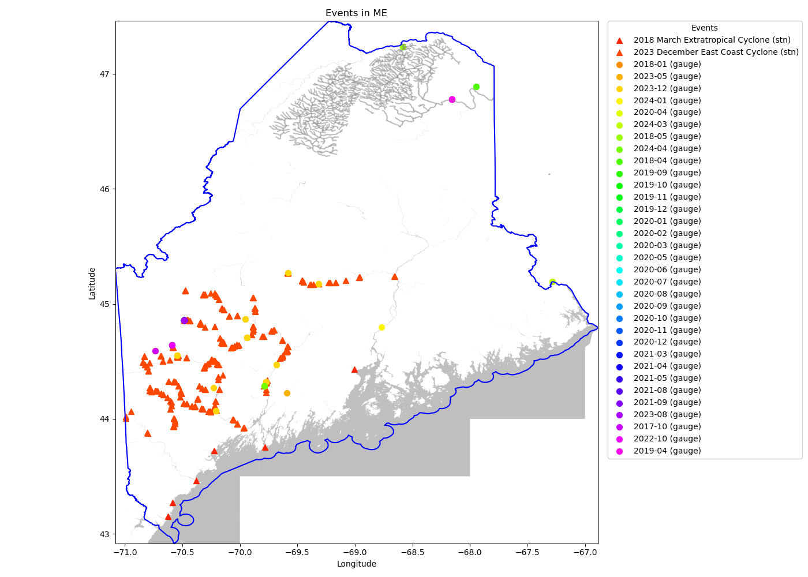
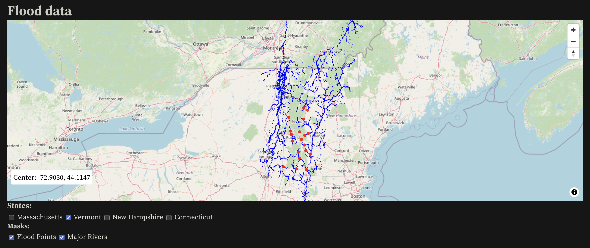
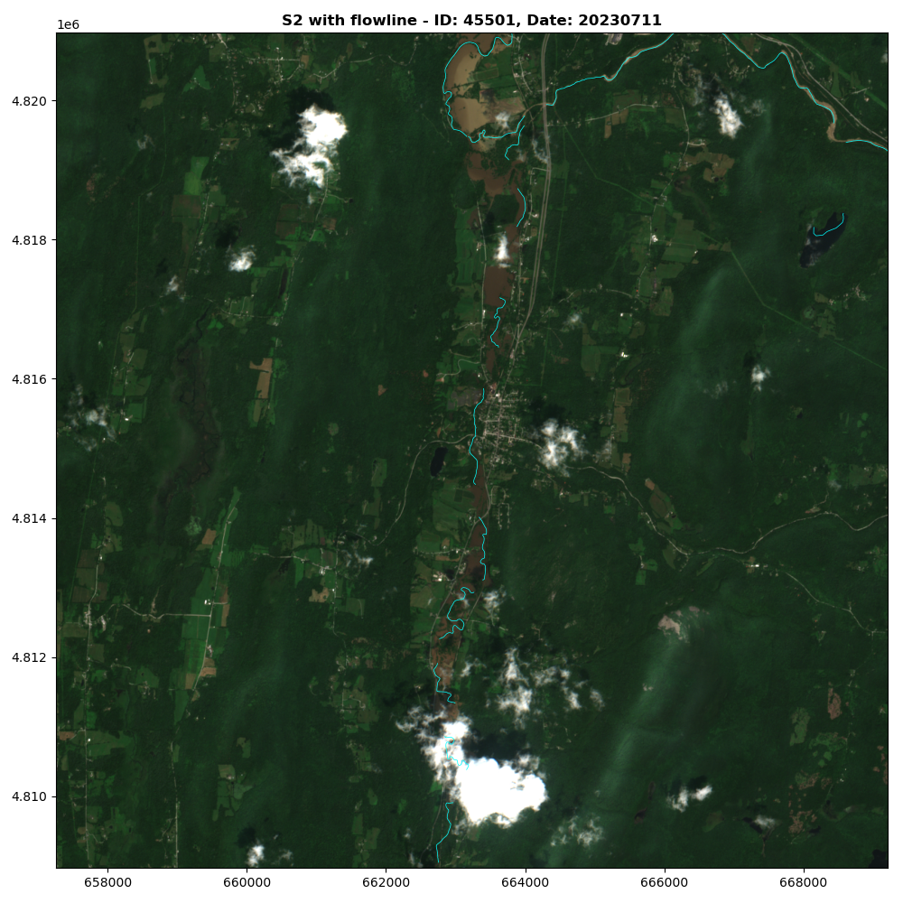
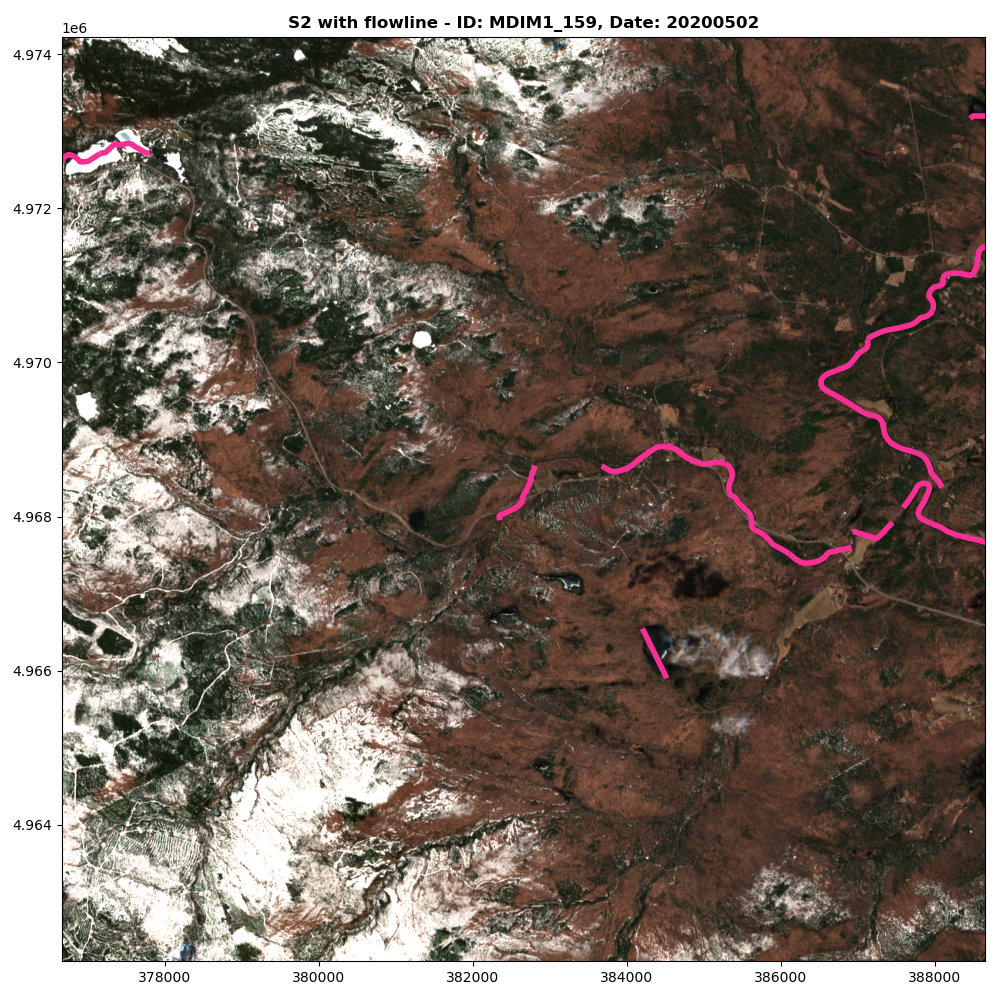
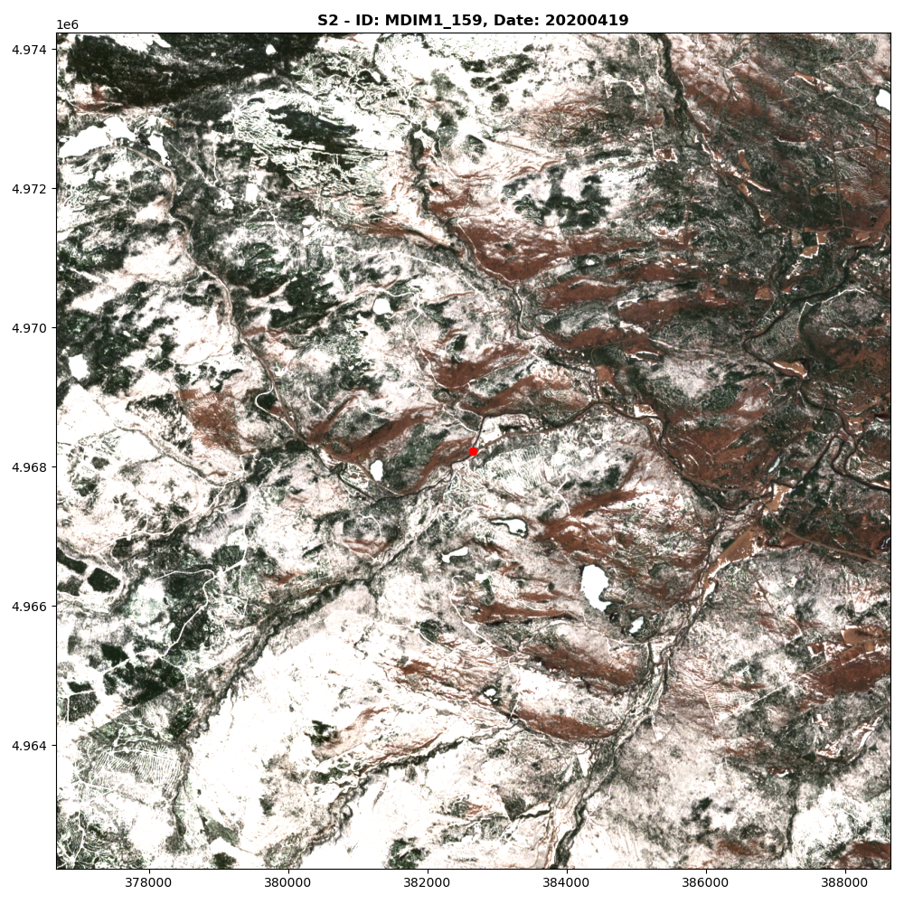
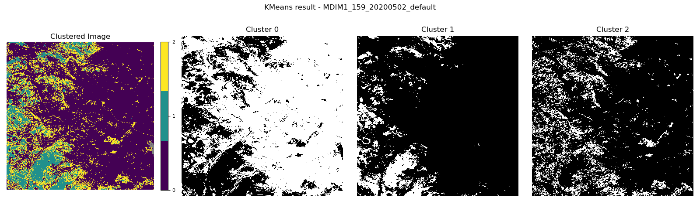
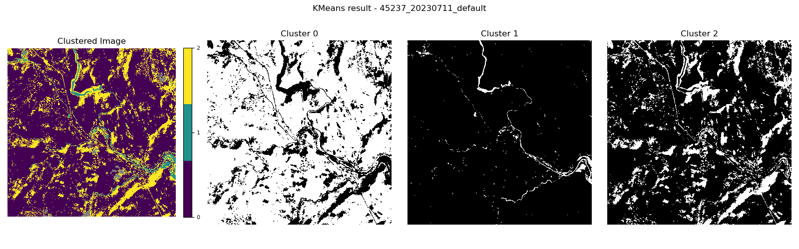
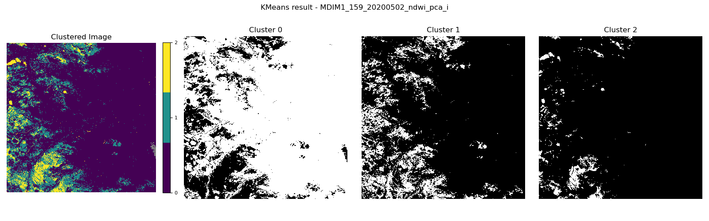

# Final Report: Inland Flooding Visualization for the State of Maine

### CS 8674 - Master’s Project  
**Faculty Advisor:** [Dr. Philip Bogden](https://www.khoury.northeastern.edu/people/philip-bogden/), The Roux Institute at Northeastern University    
**Team Members:** [Dipti Kulkarni](mailto:kulkarni.dip@northeastern.edu), [Rashaad Mirza](mailto:mirza.ra@northeastern.edu)    
**Semester:** Spring 2025

---

## 1. Introduction

This [project](https://docs.google.com/document/d/14pAnlmPhEjVojTcLnFYgJ7xc-Jl3ACxJike9pBuOEmU/edit?usp=sharing) focuses on the visualization and analysis of inland flood events in the state of Maine through satellite imagery and geospatial data overlays. It builds upon a prior research initiative led by Qian (Penny) Yin, who developed a K-means clustering-based model for flood detection using Sentinel-2 imagery and hydrological data. Our objective was to adapt and reproduce this workflow specifically for Maine, aiming to overcome regional challenges and explore the feasibility of a web-based GIS application.

---

## 2. Project Objectives

The initial proposal defined the following key objectives:
- Reproduce and adapt the existing pipeline for flood event analysis in Maine.
- Explore open-source GIS frameworks (ObservableHQ, MapLibre) for visualization.
- Evaluate web technology stacks (MERN/MEAN) for possible frontend deployment.
- Investigate the feasibility of deploying an interactive web-based flood map.
- Extend the model to integrate new spatial features such as proximity to flowlines.

---

## 3. Technical Foundations and Early Development

### 3.1 Repository Forking and Debugging (Late Jan to Mid-Feb)

The project commenced on January 30, 2025, with our first weekly check-in with Dr. Bogden. We forked Penny's GitHub repository and began resolving key compatibility issues. Notably, the pipeline failed for New Hampshire's shapefile dataset. We successfully debugged and restored functionality.

Key contributions in this phase:
- Debugged and restored compatibility with non-default shapefiles.
- Standardized variable and folder nomenclature across the repo.
- Addressed evolving data source protocols (US Census, Google Earth Engine).
- Documented fallback steps for recurring authentication or access issues.

### 3.2 Exploration of Open-Source Tools (Mid-Feb)

As part of our early prototyping, we evaluated several open-source tools suitable for building a geospatial web application. This included:
- ObservableHQ: A reactive notebook environment that supports JavaScript-based data visualization. It enabled rapid experimentation and inline documentation.
- MapLibre: An open-source mapping library that allowed interactive rendering of geospatial layers similar to Mapbox GL JS.
- Leafmap: A Python-based wrapper for simplifying the use of geospatial data with Jupyter notebooks, useful for visualizing GeoTIFFs and shapefiles without complex client-side scripting.

We tested these tools using sample geocoded flood event data and experimented with mapping overlays such as flowlines and satellite raster imagery. ObservableHQ’s seamless integration with JavaScript libraries like MapLibre made it a compelling option for lightweight GIS app development. However, provided an intuitive interface for early data exploration and preprocessing, particularly helpful when validating intermediate outputs.

We favored these open-source tools over traditional web stacks (e.g., MERN/MEAN) for several reasons:
- Rapid prototyping with built-in spatial visualization support, eliminating the need to build mapping functionality from scratch.
- Lower technical barrier to entry compared to setting up a full-stack web environment.
- Public datasets and scripting libraries used in data science workflows.
- The fact that our project used publicly available data meant we had no immediate need for user authentication or database-level security, which are key strengths of full-stack frameworks like MERN/MEAN.
- Better support for geospatial formats.
- Interactive prototyping capabilities, especially critical in early-phase validation and debugging.

However, while these tools proved valuable for experimentation and visualization in controlled environments, they still required additional infrastructure and integration effort for large-scale, persistent deployment.

### 3.3 Evaluation of Web Tech Stack (Mid- to Late-Feb)

In parallel, we evaluated the feasibility of building a full-scale web application using two widely adopted development stacks:
- MERN (MongoDB, Express.js, React, Node.js)
- MEAN (MongoDB, Express.js, Angular, Node.js)

We compared these stacks based on:
- Ease of integration with mapping libraries such as MapLibre.
- Backend support for raster data processing and API design.
- Frontend flexibility for rendering dynamic flood event visualizations.
- Community support and modularity for future scaling.

While both stacks offered robust features, they also required building the geospatial rendering layer from scratch. Unlike ObservableHQ and Leafmap, which provided immediate spatial mapping capabilities, MERN/MEAN would have involved significant development overhead just to reach an equivalent visualization baseline.

Compounding this challenge were the performance limitations we encountered when attempting to load and render large satellite datasets (e.g., Sentinel-2 imagery) and vector overlays within a browser-based frontend. Without dedicated GPU resources or optimized tile servers, real-time rendering under these stacks was not feasible for our use case.

### 3.4 Reflection

Despite promising results from prototyping with open-source tools, and initial evaluation of web stacks such as MERN and MEAN, we determined that the available computational resources and platform capabilities were not sufficient to support a robust and scalable web GIS application, particularly when working with large raster datasets such as Sentinel-2 imagery and layered vector data.

Consequently, the web deployment phase was deferred, and focus shifted toward documenting a cloud-based, big data approach. This strategic pivot allowed us to prioritize:
- Architectural scalability over front-end polish,
- Asynchronous processing pipelines over real-time interactivity,
- Integration with distributed geospatial datasets (e.g., USGS, Google Earth Engine).

This shift not only aligned better with the resource constraints of the current project phase, but also laid the foundation for future expansion through cloud-native infrastructure and containerized services.

Check out [inland_flooding-observable](inland_flooding-observable).

---

## 4. Visualization and Overlay for Maine (Early March)

We focused on adapting Penny's visualization and overlay workflow to datasets specific to the state of Maine. The objective was to recreate the data integration process that overlays segmented satellite imagery with auxiliary geospatial layers, including river flowlines, elevation data, and high-water marks.

This step was critical in evaluating whether the segmentation pipeline and visual outputs developed in the prior project could be generalized to new regions, particularly those with sparser flood documentation and more challenging environmental conditions. Maine was selected precisely because of these difficulties, offering a strong test case for generalizability.

### 4.1 Key Challenges Encountered

Despite a structured methodology, the adaptation process revealed several region-specific data limitations:
- **Satellite Imagery Gaps**: Sentinel-2 imagery for Maine during actual flood events was **extremely limited or unavailable**. Most images retrieved corresponded to pre-flood or dry periods, severely limiting our ability to compare flooded vs. non-flooded states and reducing the usefulness of the K-means segmentation model.
- **Discontinuous Flowlines**: The **National Hydrography Dataset (NHD)** shapefiles for Maine exhibited **fragmented and spatially sparse flowlines**, often failing to align with visible water features in the satellite imagery. In contrast, the Vermont datasets used in the original pipeline provided continuous and topologically sound hydrological data.

<table>
  <tr>
    <th>Vermont Flowlines – Continuous and Aligned (July 2023)</th>
    <th>Maine Flowlines – Fragmented and Misaligned (May 2020)</th>
  </tr>
  <tr>
    <td></td>
    <td></td>
  </tr>
</table>

<em>Figure: Comparison of hydrological flowline continuity between Vermont and Maine NHD datasets.</em>

- **Snow Cover Noise**: Many images captured during relevant timeframes showed **extensive snow cover**, especially in northern Maine. This introduced significant reflectance-based noise into the RGB image bands, which confused the unsupervised segmentation algorithm by mimicking water surfaces.

### 4.2 Adjustments and Partial Outcomes

Despite these limitations, we continued to test the overlay pipeline with the available datasets:
- We manually adjusted rendering parameters for **flowline shapefiles** (e.g., stroke width, color, z-index) to better match them with visible hydrological features in Maine’s imagery. This was necessary to verify georeferencing accuracy and better visualize regional flow networks.
- Attempts were made to apply **Penny's segmentation pipeline** to Maine scenes, but the absence of during-flood images meant that the output clusters could not be confidently interpreted as representing floodwater.
- We also initiated documentation of **region-specific considerations** that must be taken into account when scaling the pipeline to other states or data environments. These include snow/seasonality filters, additional cloud masking techniques, and the need for regional customization of hydrological masks.

### 4.3 Reflection

This visualization and overlay phase underscored a central lesson of the project: a one-size-fits-all approach to flood detection is limited by the quality, availability, and environmental context of regional data. While Vermont served as an effective demonstration region, Maine revealed the constraints that come with sparse flooding records, seasonal interference, and inconsistent vector data. These findings informed later decisions to pivot away from a full deployment and instead emphasize methodological extensibility and cloud-based processing frameworks.

**Maine – Flood Cluster Detection using Default Method (Cluster 1)**  

**Vermont – Flood Cluster Detection using Default Method (Cluster 1)**

*Figure: Default K-means clustering results for flood detection in Maine and Vermont. The Maine output shows diffuse and noisy clusters due to environmental and data limitations, while the Vermont result captures clearer flood boundaries aligned with ground truth.*

**Maine – Flood Cluster Detection using NDWI PCA Index (Cluster 2)**

---

## 5. Flood Events Visualization: Flowline Enhancement and Metric Development (Late March)

During the final week of March, our focus turned toward refining how hydrological features were represented and utilized within the flood detection workflow. This phase involved two parallel efforts aimed at improving both visual clarity and analytical depth of the model's output.

### 5.1 Enhanced Flowline Visualization

We first concentrated on improving the visual integration of flowlines with satellite imagery. This enhancement was motivated by earlier challenges in Maine, where fragmented and low-contrast flowlines diminished interpretability. To address this, we:
- Adjusted color, opacity, and thickness of flowline overlays for improved legibility.
- Conducted side-by-side visual tests to ensure that major river paths remained visible across varying resolutions and backgrounds.
- Confirmed alignment and georeferencing of the flowline shapefiles to minimize misplacement.

These improvements significantly aided visual inspection and interpretation of hydrologic features in satellite composites.

### 5.2 Distance-to-Flowline Metric: Experimentation on Vermont Data

In parallel, we introduced a proximity-to-flowline metric as an exploratory spatial feature. This was implemented and tested on Vermont datasets, which offered more coherent and well-labeled flowline layers compared to Maine.

We generated proximity buffers at varying distances, 50px, 100px, and 150px, from flowline features and analyzed their spatial intersection with detected flood zones. The aim was to explore whether spatial closeness to river channels correlated with water presence or segmentation performance.

Key insights from this analysis include:
- Proximity zones provided a useful spatial filter for prioritizing candidate flood regions.
- In areas with continuous flowlines, particularly in Vermont, the metric aligned well with observed flood extents.
- The method highlighted the importance of flowline data quality, reinforcing the need for region-specific preprocessing in future deployments.

This effort in spatial feature engineering enhanced both the interpretability and analytical rigor of the segmentation workflow, while also demonstrating the potential for heuristic modeling of flood-prone areas through distance-based buffering techniques.

---

## 6. Deployment Strategy and Strategic Pivot (April)

The original plan included deploying an interactive GIS application. However, due to computational constraints and incomplete datasets, we did not proceed with deployment.

Instead, we prepared a [white paper](https://docs.google.com/document/d/1zeiTgkxdsBEhnq9DyQo881WCS3tXlJ3tPtyCI1jGaDs/edit?usp=sharing) outlining:
- Cloud infrastructure recommendations for scalable flood data analysis
- Storage and compute considerations for handling high-resolution satellite imagery
- Integration of federated hydrological datasets

This pivot aligned with our core learning goals and allowed us to focus on scalable solutions.

---

## 7. Literature Review

A [literature review](https://rmirza.notion.site/?pvs=4) was conducted to contextualize our methodology and understand state-of-the-art practices. Five key papers were identified covering:
- Understanding Flooding Detection Using Overhead Imagery - Lessons Learned
- Flood Detection in Urban Areas Using Satellite Imagery and Machine Learning
- Optimized Deep Learning Model for Flood Detection Using Satellite Images
- A Satellite Imagery-Driven Framework for Rapid Resource Allocation in Flood Scenarios to Enhance Loss and Damage Fund Effectiveness
- Flood Detection in Gaofen-3 SAR Images via Fully Convolutional Networks

This survey informed our methodology and reinforced our decision to pivot toward scalable data workflows.

---

## 8. Conclusion and Future Work

Our work directly builds on Penny's project, which focused on Vermont and high-quality post-flood imagery. Her contributions included integrating multiple geospatial masks (cloud, NDWI, flowline) and applying K-means clustering with PCA-based optimization.

Our Contributions Beyond Penny's Work:
- Adapted pipeline to New Hampshire and Maine datasets.
- Documented edge cases and handled data integrity issues.
- Introduced a proximity-to-flowline metric as a novel feature.
- Proposed a [big data strategy](https://docs.google.com/document/d/1zeiTgkxdsBEhnq9DyQo881WCS3tXlJ3tPtyCI1jGaDs/edit?usp=sharing) to overcome scalability and deployment constraints.

While we were unable to deploy a web-based GIS tool due to resource constraints, this project provided meaningful advancements in methodology, data understanding, and architectural planning.

Future directions include:
- Collecting and labeling flood-time Sentinel-2 imagery for Maine.
- Improving flowline quality through stream order filtering or DEM alignment.
- Deploying the enhanced model within a cloud-based notebook or containerized app.
- Integrating elevation-based flood risk predictions with segmentation models.

This project contributes to the broader goal of flood resilience by refining a modular, data-driven workflow tailored to underrepresented regions like Maine.

We also presented this project at the Roux Student Showcase 2025, where we shared our findings with faculty, peers, and external stakeholders. The poster summarizing our methodology, challenges, and insights is available here:  
🔗 [View Project Poster](https://drive.google.com/file/d/1m0meKFn_hhuGDvpFrGXYoQImDbN9ta4P/view?usp=drive_link)

---

## Appendix
- [Project Proposal](https://docs.google.com/document/d/14pAnlmPhEjVojTcLnFYgJ7xc-Jl3ACxJike9pBuOEmU/edit?usp=sharing)
- [GitHub Repository](https://github.com/dvk65/inland-flooding)
- [White Paper on Big Data Approach](https://docs.google.com/document/d/1zeiTgkxdsBEhnq9DyQo881WCS3tXlJ3tPtyCI1jGaDs/edit?usp=sharing)
- [Literature Review Notes](https://rmirza.notion.site/?pvs=4)

---

## Acknowledgments
We thank [Dr. Philip Bogden](https://www.khoury.northeastern.edu/people/philip-bogden/) for his mentorship and continued guidance throughout the semester. His feedback helped us pivot meaningfully and stay focused on value-driven research goals.
