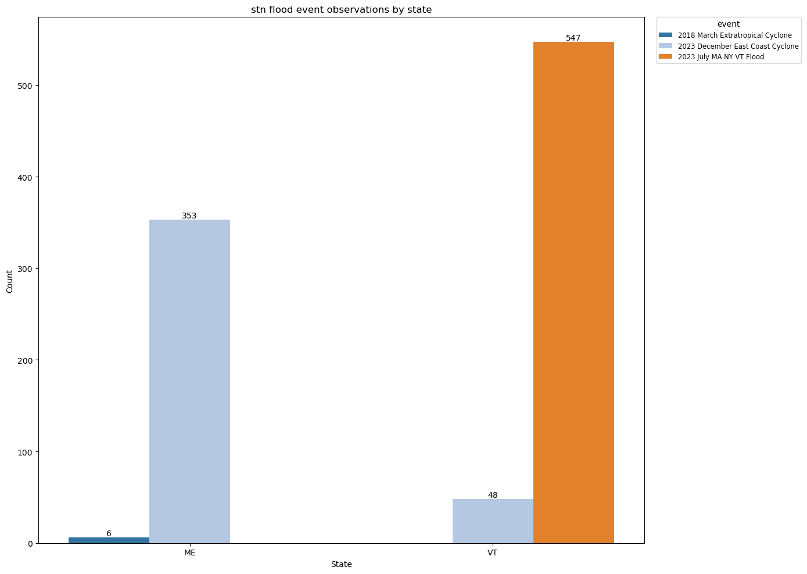

# Report - Automated Assessment of Inland Flooding From Satellite Observations
This project focuses on developing an algorithm for automated assessment of inland flooding from satellite observations. Specifically, this algorithm collects satellite images captured before/during/after flood events and applies the K-means clustering algorithm to automatically identify flooded areas. 

Satellite data, particularly from Sentinel-2 with its 10-meter resolution, provides a powerful tool for observing and analyzing flood events in detail. Although weather conditions during flood events can be challenging, this project explores the potential of utilizing satellite imagery and machine learning techniques to identify flooded areas. Moreover, this approach seeks to offer insights into enhancing flood detection using drone measurements.  

**Area of Interests**: The project initially focused on Maine. However, due to limited flood event observations in Maine, it has been expanded to include other states in the New England Region (primarily Vermont) which shares similar flood characteristics.

## Method
1. Collect flood event data from two sources: high-water marks available through the USGS STN Flood Event Data Portal and high-water levels extracted from real-time gauge water levels provided by USGS Water Data Services;
2. Collect satellite images captured before, during, and after flood event observations;
3. Apply the K-means clustering algorithm to identify flooded areas

## Data
The approach integrates the datasets described in the table below:
| **Name** | **Source** | **Description** | **Format** | **Links** |
|---|---|---|---|---|
| [High-water marks](https://www.usgs.gov/special-topics/water-science-school/science/high-water-marks-and-flooding) | [STN flood event data](https://stn.wim.usgs.gov/STNDataPortal/) | validated flood event observations from USGS | CSV | [Report>](REPORT.md) [Guide>](GUIDE.md) [Data>](https://drive.google.com/drive/folders/1HnRyw0KoQEsYrYD9Uid-N08lBs0q-1jo?usp=sharing) |
| [High-water levels](https://www.weather.gov/aprfc/terminology) | [USGS Water Data Services](https://waterdata.usgs.gov/nwis/rt) | real-time gauge water levels above moderate flood stage | CSV | [Report>](REPORT.md) [Guide>](GUIDE.md) [Data>](https://drive.google.com/drive/folders/1HnRyw0KoQEsYrYD9Uid-N08lBs0q-1jo?usp=sharing) |
| [Sentinel-2 images](https://developers.google.com/earth-engine/datasets/catalog/sentinel-2) | [Sentinel-2 Level-2A](https://developers.google.com/earth-engine/datasets/catalog/COPERNICUS_S2_SR_HARMONIZED) | satellite images corresponding to the areas of interests and timeframes defined by high-water marks and levels | GeoTIFF | [Report>](REPORT.md) [Guide>](GUIDE.md) [Data>](https://drive.google.com/drive/folders/1HnRyw0KoQEsYrYD9Uid-N08lBs0q-1jo?usp=sharing) |
| [Cloud and Shadow](https://developers.google.com/earth-engine/tutorials/community/sentinel-2-s2cloudless) masks | [s2cloudless](https://developers.google.com/earth-engine/tutorials/community/sentinel-2-s2cloudless) | cloud and shadow pixels to be removed | GeoTIFF | [Report>](REPORT.md) [Guide>](GUIDE.md) [Data>](https://drive.google.com/drive/folders/1HnRyw0KoQEsYrYD9Uid-N08lBs0q-1jo?usp=sharing) |
| [NDWI](https://eos.com/make-an-analysis/ndwi/) masks | [Usage Description](https://medium.com/@melqkiades/water-detection-using-ndwi-on-google-earth-engine-2919a9bf1951) | water body pixels defined by Normalized Difference Water Index | GeoTIFF | [Report>](REPORT.md) [Guide>](GUIDE.md) [Data>](https://drive.google.com/drive/folders/1HnRyw0KoQEsYrYD9Uid-N08lBs0q-1jo?usp=sharing) |
| [Flowlines](https://www.usgs.gov/ngp-standards-and-specifications/national-hydrography-dataset-nhd-data-dictionary-feature-classes) masks | [National Hydrography Dataset](https://www.usgs.gov/national-hydrography/access-national-hydrography-products) | routes that make up a linear surface water drainage network | Shapefile | [Report>](REPORT.md) [Guide>](GUIDE.md) [Data>](https://drive.google.com/drive/folders/1HnRyw0KoQEsYrYD9Uid-N08lBs0q-1jo?usp=sharing) |

## Result
This section presents the findings organized into three key parts: flood event data, Sentinel-2 imagery and masks analysis, and K-means clustering outcomes. 

### Flood Event Data
Flood event data consists of high-water marks from USGS STN Flood Event Data Portal and high-water levels extracted from real-time gauge water levels provided by USGS Water Data Services. This data is essential for analyzing the distribution of flood events across the New England Region and it's used as a crucial input for retrieving corresponding Sentinel-2 satellite imagery.

Below is a summary table outlining the key characteristics of the flood event data:
| \ | **High-water marks** | **High-water levels** |
|---|---|---|
| **Count of unique values in each attribute** | id (889) event (5) state (6) county (28) latitude (863) longitude (860) note (837) source (1) | id (218) event (25) event_day (83) state (6) county (34) latitude (68) longitude (68) note (60) source (1) |
| **Top 3 counts by event** | 2023 July MA NY VT Flood (641) 2018 March Extratropical Cyclone (115) 2018 January Extratropical Cyclone (81)| 2023-12 (64) 2023-07 (27) 2024-01 (18) |
| **Top 3 counts by state** | VT (646) MA (282) CT (72) | CT (57) VT (56) ME (40) |

#### High-water marks
High-water marks are validated flood event observations published by the USGS. The original dataset has 53 attributes and 3502 observations. For this project, only 7 of these attributes and 889 observations were selected for the following reason:
- This project focuses on the locations and dates of flood event observations so attributes such as `hwmTypeName` and `verticalDatumName` were excluded as they are not directly relevant;
- Some of the flood events, such as the 1991 October Extratropical Cyclone, are too old to have corresponding Sentinel-2 imagery which has only been available since 2015;
- Some locations (`latitude`, `longitude`) have multiple high-water marks with different `elev_ft` measured.

Below are two figures illustrating the distribution of high-water marks:
| \ | **Figure** | **Note** |
|---|---|---|
| **Countplot** |  | Maine, the initial targeted state, has only 6 observations. Vermont is the state with the largest number of observations. The flood event `2023 July MA NY VT Flood` is the event with the largest number of observations (547). |
| **VT map (Top 1 counts by state)** |  | In this map, triangle markers are high-water marks. Many high-water marks are clustered close to each other. The majority is from the flood event `2023 July MA NY VT Flood`. |

**Discussion**
- The distribution of high-water marks suggests that the 2023 July MA NY VT flood event in Vermont is likely the most suitable dataset for satellite imagery collection since it has the largest number of observations. 
- However, the close proximity of some high-water marks presents a challenge for satellite imagery collection, as the buffer regions around these points may significantly overlap. This issue will be carefully considered in the satellite imagery collection process.
- High-water marks in the dataset are not assigned precise flood event dates. To address this, online reports were consulted to determine the specific dates of the events. 
- The details about the dataset and processing steps are documented in the [GUIDE](GUIDE.md).

#### High-water levels
High-water levels has 9 attributes and 218 observations. This dataset is not directly downloaded. The collection of high-water levels consists of three steps:
1. collect NWSLI identifiers and descriptions for the gauges from NOAA;
2. identify the corresponding usgsid for each gauge and gather flood-related information, including flood stage thresholds and flood impacts;
3. collect real-time water levels using usgsid and compare them with moderate flood stage thresholds to identify observations where levels exceed the moderate flood stage.

Exemplar:
1. [ME gauge list](https://hads.ncep.noaa.gov/charts/ME.shtml);
2. [Flood-related Information - Kennecbec River at Augusta Information with NWSLI ASTM1](https://water.noaa.gov/gauges/ASTM1);
3. [Water Levels - Kennebec River at Augusta with NWSLI ASTM1 and USGSID 01049320](https://waterdata.usgs.gov/monitoring-location/01049320/#parameterCode=00065&period=P7D&showMedian=false) and constructed [URL to retrieve data between 2017-03-28 and 2018-05-23](https://nwis.waterservices.usgs.gov/nwis/iv/?sites=01049320&parameterCd=00065&startDT=2017-03-28T00:00:00.000-05:00&endDT=2018-05-23T23:59:59.999-04:00&siteStatus=all&format=rdb) (date range set for demonstration only).

Below are two figures illustrating the distribution of high-water levels:
| \ | **Figure** | **Note** |
|---|---|---|
| **Countplot** |  | The number of high-water levels varies much across the states. Overall, NH and RI have fewer observations. Some events dominate in certain states such as 2023-07 in VT. This figure illustrates the affected areas of flood events. (more) |
| **CT map (Top 1 counts by state)** |  | In this map, circle markers are high-water levels. They are widely distributed across the state. (more) |

**Discussion**
- The flood stage thresholds may be modified; therefore, the collected high-water levels can be different. Therefore, this dataset need to be used carefully.
- The details about the dataset and processing steps are documented in the [GUIDE](GUIDE.md).

#### HWM and HWL
Both high-water marks and high-water levels are used in collecting Sentinel-2 imagery and masks. However, based on the previous result, the majority of the collected images will be from 2023 Summer flood event. (more)

### Sentinel-2 True Color Imagery, Cloud Masks, NDWI Masks, and Flowline Masks
Sentinel-2 satellite provides high-quality images with 10-meter resolution. The selected band combination is B4, B3, B2 which represents the natural color visualization. The filtered dataset consists of 102 Sentinel-2 True Color images, each paired with corresponding masks for clouds, shadows, NDWI, and flowlines. 

* [True Color](https://custom-scripts.sentinel-hub.com/custom-scripts/sentinel-2/composites/) - band combination of red (B04), green (B03), and blue (B02)

#### Sentinel-2 True Color Imagery
Initially, 379 Sentinel-2 True Color images, along with their corresponding CLOUD and NDWI masks, were downloaded. These images represented 17 different flood events and were collected using 1107 flood event observations. However, after visualizing the first 5 observations, some images were found to be unsuitable for analysis (specific reasons to be added). Following this evaluation, the July 2023 flood event was selected for further analysis and K-means clustering.

The refined dataset of ideal Sentinel-2 True Color images comprises 102 images, with 25 collected during flood events. Upon further exploration, 10 of these images were identified to show significant flooded areas through visual inspection. The IDs of these images are 44909, 44929, 45067, 45237, 45321, 45358, 45427, 45501, MNTM3_114, and TMVC3_39. 

Below is a table showing some of the collected images.
| \ | **Figure** | **Note** |
|---|---|---|
| **44909** |  | from STN high-water marks |
| **45358** |  | from STN high-water marks |
| **TMVC3_39** |  | from Gauge high-water levels |
| **Some of removed ids and images** |  | In the top image set, The image with date 20230706 is dropped due to the cloud cover. In the bottom image set, even though the river is brown. The color similarity indicates that it's not an ideal image for this project. |

####  Cloud Masks and NDWI Masks (from Earth Engine)
When downloading Sentinel-2 images, [s2cloudless](https://developers.google.com/earth-engine/tutorials/community/sentinel-2-s2cloudless) is utilized to extract the cloud and shadow mask. This step is included to drop the cloud and shadow pixels in Kmeans clustering algorithm. The cloud masked created using the s2cloudless algorithm can be affected by high reflectance which is demonstrated below.

Below is a table showing the cloud masks.
| \ | **True Color** | **Cloud Mask** |
|---|---|---|
| **44909** |  |  |
| **45358** |  |  |

Also, NDWI mask is collected when downloading Sentinel-2 images. After that, the NDWI threshold is selected by comparison. Below is a table showing the threshold selection. The selected threshold is -0.1.
| \ | **NDWI thresholds**| **True Color** |
|---|---|---|
| **44909** |  |  |
| **45358** |  |  |

#### Flowline Masks
Flowlines from NHD is introduced to help identify the flooded areas and enhance KMeans clustering performance. In this project, the focus is major rivers based on the visual inspection. Therefore, the major rivers are selected from flowlines. However, there might be a better approach to idetify major rivers. 

| \ | **Flowline**| **Major River** |
|---|---|---|
| **44909** |  |  |

### KMeans Clustering Result

Below is the result of 44909
| \ | **True Color**| **Result** |
|---|---|---|
| **Default** |  |  |
| **PCA** |  |  |
| **PCA with flowline** |  |  |
| **PCA with NDWI** |  |  |
| **PCA with flowline and NDWI** |  |  |

### Comparison between Target Cluster (Flooded Area) and NDWI

| \ | **NDWI**| **Best Cluster** | **Pixels** |
|---|---|---|---|
| **44909** |  |  | NDWI: 37389 Target Cluster: 36039 |
| **45358** |  |  | NDWI: 36823 Target Cluster: 36715 |

### Future Work
