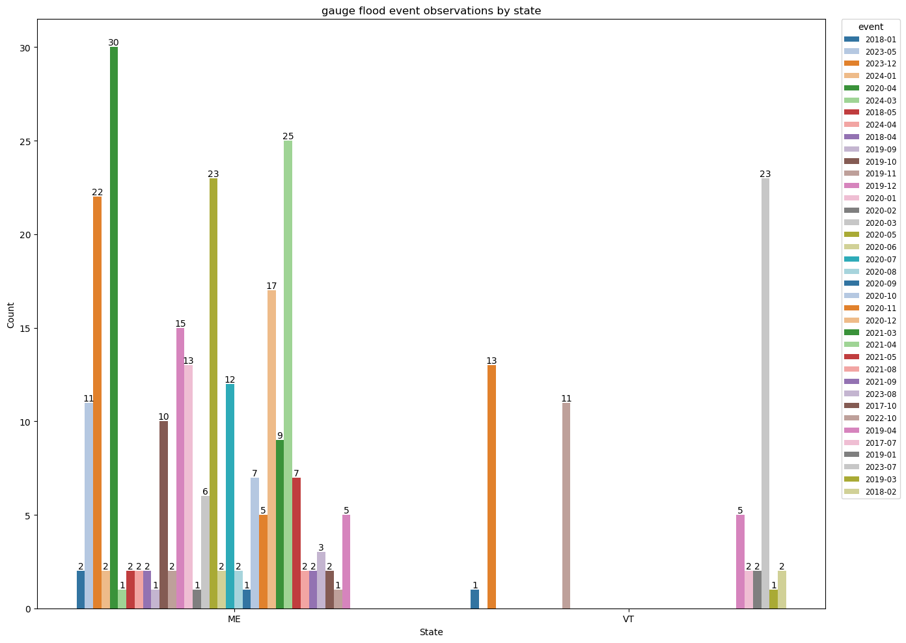
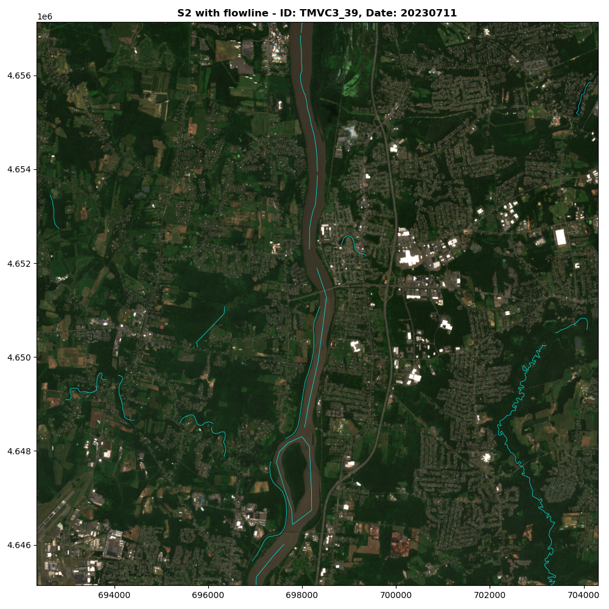

# Report - Automated Assessment of Inland Flooding From Satellite Observations
This project focuses on developing an algorithm for automated assessment of inland flooding from satellite observations. Specifically, this algorithm collects satellite images captured before/during/after flood events and applies the K-means clustering algorithm to automatically identify flooded areas. 

Satellite data, particularly from Sentinel-2 with its 10-meter resolution, provides a powerful tool for observing and analyzing flood events in detail. Although weather conditions during flood events can be challenging, this project explores the potential of utilizing satellite imagery and machine learning techniques to identify flooded areas. Moreover, this approach seeks to offer insights into enhancing flood detection using drone measurements.  

**Area of Interests**: The project initially focused on Maine. However, due to limited flood event observations in Maine, it has been expanded to include other states in the New England Region (primarily Vermont) which shares similar flood characteristics.

## 1. Method
1. Collect flood event data from two sources: high-water marks available through the USGS STN Flood Event Data Portal and high-water levels extracted from real-time gauge water levels provided by USGS Water Data Services;
2. Collect satellite images captured before, during, and after flood event observations;
3. Apply the K-means clustering algorithm to identify flooded areas

## 2. Data
The approach integrates the datasets described in the table below:
| **Name** | **Source** | **Description** | **Format** | **Links** |
|---|---|---|---|---|
| [High-water marks](https://www.usgs.gov/special-topics/water-science-school/science/high-water-marks-and-flooding) | [STN flood event data](https://stn.wim.usgs.gov/STNDataPortal/) | validated flood event observations from USGS | CSV | [Report>](REPORT.md) [Guide>](GUIDE.md) [Data>](https://drive.google.com/drive/folders/1HnRyw0KoQEsYrYD9Uid-N08lBs0q-1jo?usp=sharing) |
| [High-water levels](https://www.weather.gov/aprfc/terminology) | [USGS Water Data Services](https://waterdata.usgs.gov/nwis/rt) | real-time gauge water levels above moderate flood stage | CSV | [Report>](REPORT.md) [Guide>](GUIDE.md) [Data>](https://drive.google.com/drive/folders/1HnRyw0KoQEsYrYD9Uid-N08lBs0q-1jo?usp=sharing) |
| [Sentinel-2 images](https://developers.google.com/earth-engine/datasets/catalog/sentinel-2) | [Sentinel-2 Level-2A](https://developers.google.com/earth-engine/datasets/catalog/COPERNICUS_S2_SR_HARMONIZED) | satellite images corresponding to the areas of interests and timeframes defined by high-water marks and levels | GeoTIFF | [Report>](REPORT.md) [Guide>](GUIDE.md) [Data>](https://drive.google.com/drive/folders/1HnRyw0KoQEsYrYD9Uid-N08lBs0q-1jo?usp=sharing) |
| [Cloud and Shadow](https://developers.google.com/earth-engine/tutorials/community/sentinel-2-s2cloudless) masks | [s2cloudless](https://developers.google.com/earth-engine/tutorials/community/sentinel-2-s2cloudless) | cloud and shadow pixels to be removed | GeoTIFF | [Report>](REPORT.md) [Guide>](GUIDE.md) [Data>](https://drive.google.com/drive/folders/1HnRyw0KoQEsYrYD9Uid-N08lBs0q-1jo?usp=sharing) |
| [NDWI](https://eos.com/make-an-analysis/ndwi/) masks | [NDWI tutorial](https://medium.com/@melqkiades/water-detection-using-ndwi-on-google-earth-engine-2919a9bf1951) | water body pixels defined by Normalized Difference Water Index | GeoTIFF | [Report>](REPORT.md) [Guide>](GUIDE.md) [Data>](https://drive.google.com/drive/folders/1HnRyw0KoQEsYrYD9Uid-N08lBs0q-1jo?usp=sharing) |
| [Flowlines](https://www.usgs.gov/ngp-standards-and-specifications/national-hydrography-dataset-nhd-data-dictionary-feature-classes) masks | [National Hydrography Dataset](https://www.usgs.gov/national-hydrography/access-national-hydrography-products) | routes that make up a linear surface water drainage network | Shapefile | [Report>](REPORT.md) [Guide>](GUIDE.md) [Data>](https://drive.google.com/drive/folders/1HnRyw0KoQEsYrYD9Uid-N08lBs0q-1jo?usp=sharing) |

## 3. Result
This section presents the findings organized into three key parts: flood event data, Sentinel-2 imagery and masks analysis, and K-means clustering outcomes. 

### 3.1 Flood Event Data from High-Water Marks
High-water marks are validated flood event observations published by the USGS. The original dataset has 53 attributes and 3502 observations. For this project, only 7 of these attributes and 889 observations were selected for the following reason:
- This project focuses on the locations and dates of flood event observations so attributes such as `hwmTypeName` and `verticalDatumName` were excluded as they are not directly relevant;
- Some of the flood events, such as the 1991 October Extratropical Cyclone, are too old to have corresponding Sentinel-2 imagery which has only been available since 2015;
- Some locations (`latitude`, `longitude`) have multiple high-water marks with different `elev_ft` measured.

#### 3.1.1 Summary Table

Below is a table summarizing the key characteristics of the high-water marks:
|**Atribute**|**Count of unique values**|**Top 3 event**|**Top 3 state**|
|-|-|-|-|
|id event state county latitude longitude note source|889 5 6 28 863 860 837 1| 2023 July MA NY VT Flood 2018 March Extratropical Cyclone 2018 January Extratropical Cyclone| VT MA CT|

**_Insight_**
- The table indicates that all six states in the New England region were affected by five significant flood events, but the impact varied across the states.To explore the distribution of high-water marks across different states and events, visualization techniques including countplots and maps are implemented.

#### 3.1.2 Visualization
Below are two figures illustrating the distribution of high-water marks:
|**Countplot**|**VT map (Top 1 state)**|
|-|-|
|||

**_Insight_**
- The countplot groups high-water marks by state and flood events, illustrating the distribution of flood event observations in each state. It is evident that Vermont has the largest number of observations, particularly from the `2023 July MA NY VT Flood` event (547 observations). In contrast, Maine, the initially targeted state, has only 6 observations.  
- The map represents the spatial distribution of high-water marks in Vermont which has the largest number of observations. In this map, triangle markers are high-water marks. A significant number of high-water marks are clustered closely together and the majority is from the flood event `2023 July MA NY VT Flood`.
- The distribution of high-water marks suggests that the `2023 July MA NY VT Flood` event in Vermont is likely the most suitable dataset for further analysis and satellite imagery collection since it has the largest number of observations. However, the close proximity of some high-water marks presents a challenge for satellite imagery collection, as the buffer regions around these points may significantly overlap. This issue will be carefully considered in the satellite imagery collection process.

#### 3.1.3 Flood Event Date Assignment
This dataset has 5 flood events: `2018 January Extratropical Cyclone`, `2018 March Extratropical Cyclone`, `2021 Henri`, `2023 July MA NY VT Flood`, and `2023 December East Coast Cyclone`. However, the dataset lacks precise timeframes for these events, which are essential for collecting corresponding satellite imagery. To address this issue, online reports are introduced to determine the specific dates of the events. Also, they are compared with the visualization in Section 3.1.2 for further analysis. 

Below is the table with the dates assigned based on online reports:
|**Event**|**Date**|**Discussion**|
|-|-|-|
|[2018 January Extratropical Cyclone](https://en.wikipedia.org/wiki/January_2018_North_American_blizzard)|2018-01-02 (formed) to 2018-01-06 (dissipated)|According to the report from Wikipedia, Massachusetts was the most affected state during the event, with both Maine and New Hampshire experiencing significant coastal flooding. The countplot in Section 3.1.2 shows that 81 observations are from `2018 January Extratropical Cyclone` in Massachusetts. However, no observation is reported in Maine and New Hampshire.|
|[2018 March Extratropical Cyclone](https://en.wikipedia.org/wiki/March_1%E2%80%933,_2018_nor%27easter)|2018-03-01 (formed) to 2018-03-05 (dissipated)|According to the report from Wikipedia, Connecticut, Rhode Island, Massachusetts, and Maine were affected by this event, with Connecticut and Massachusetts experiencing significant flooding. However, the countplot additionally shows that New Hampshire was affected, a detail not mentioned in the Wikipedia report.|
|[2021 Henri](https://www.nhc.noaa.gov/data/tcr/AL082021_Henri.pdf)|2021-08-15 (formed) to 2021-08-23 (dissipated)|According to the report published by NOAA, "flooding was extensive, particularly in ...and Connecticut." This is also reflected in the countplot. Only Connecticut has 7 observations from `2021 Henri`.|
|[2023 July MA NY VT Flood](https://www.weather.gov/btv/The-Great-Vermont-Flood-of-10-11-July-2023-Preliminary-Meteorological-Summary)|2023-07-10 (formed) to 2023-07-11 (dissipated)|According to the report in Vermont from NOAA, Vermont experienced castastrophic flash flooding and river flooding during this event, with the affected areas widely spread across the state. Additionally, [Figure 4](https://www.weather.gov/images/btv/events/July2023Flood/Figure4.PNG) shows that Massachusetts was also impacted. These observations are consistent with the countplot and the Vermont map presented in Section 3.1.2.|
|[2023 December East Coast Cyclone](https://cw3e.ucsd.edu/wp-content/uploads/2023/12/20Dec2023_Summary/20231218EastCoast.pdf)|2023-12-17 (formed) to 2023-12-18 (dissipated)|According to the report from Scripps Institution of Oceanography, widespread moderate to major flooding occurred across the New England Region, with Flash Flood Warnings and Flood Warnings active in most states. However, the countplot reveals that only Vermont has recorded high-water marks for the `2023 December East Coast Cyclone`. This discrepancy arises because high-water mark datasets are not immediately available after flood events. The collected high-water marks undergo investigation and validation before being published. It is expected that in the near future, additional high-water marks from Maine and other affected areas will become available for analysis.|

### 3.2 Flood Event Data from High-Water Levels
High-water levels has 9 attributes and 218 observations. This dataset is not directly downloaded. The collection of high-water levels consists of three steps:
1. Collect NWSLI identifiers and descriptions for the gauges from NOAA;
    - NOAA provides charts containing National Weather Service Location Identifiers (NWSLI) for streamflow gauges in each state and the NWSLI is used to extract the gauge information in step 2 

2. Identify corresponding USGS IDs and gather flood-related information such as flood stage threshold and flood impacts;
    - The National Weather Service (NWS) assigns flood stages to gauge water levels. From one of its programs named the National Water Prediction Service, flood stage thresholds and flood impact information for each gauge are found. Additionally, this service includes USGS IDs used to extract real-time water level data from the USGS Water Data Service. 
    - It’s important to note that not all USGS stations have corresponding NWS flood stage thresholds. Some USGS-operated gauges may not be included in the NWS system. ([Example](https://waterwatch.usgs.gov/index.php?r=me&m=flood&w=table))
    - Flood stage thresholds can change over time due to changes near the gauge. As a result, the collected high-water levels may be updated periodically if using this method. 
3. Collect real-time water levels using USGS IDs and compare with moderate flood stage thresholds to identify observations where water levels exceed the moderate flood stage.

#### 3.2.1 Step-by-Step Example
1. [ME gauge list](https://hads.ncep.noaa.gov/charts/ME.shtml);
2. [Flood-related Information - Kennecbec River at Augusta Information with NWSLI ASTM1](https://water.noaa.gov/gauges/ASTM1);
3. [Water Levels - Kennebec River at Augusta with NWSLI ASTM1 and USGSID 01049320](https://waterdata.usgs.gov/monitoring-location/01049320/#parameterCode=00065&period=P7D&showMedian=false) and constructed [URL to retrieve data between 2017-03-28 and 2018-05-23](https://nwis.waterservices.usgs.gov/nwis/iv/?sites=01049320&parameterCd=00065&startDT=2017-03-28T00:00:00.000-05:00&endDT=2018-05-23T23:59:59.999-04:00&siteStatus=all&format=rdb) (date range set for illustration only).

#### 3.2.2 Summary Table
Below is a table summarizing the key characteristics of the high-water levels:
|**Atribute**|**Count of unique values**|**Top 3 event**|**Top 3 state**|
|-|-|-|-|
|id event event_day state county latitude longitude note source|218 25 83 6 34 68 68 60 1| 2023-12 2023-07 2024-01| CT VT ME|

**_Insight_**
- The table indicates that all six states in the New England region were affected by 25 flood events. However, the total number of high-water levels is 218. Therefore, there may not be an event that has a very high number of observations. To understand more about the distribution of high-water marks, visualization techniques including countplots and maps are added.

#### 3.2.3 Visualization
Below are two figures illustrating the distribution of high-water marks:
|**Countplot**|**VT map (Top 1 state)**|
|-|-|
|||

**_Insight_**
- The countplot groups high-water levels by state and flood events, showing the distribution of flood event observations acroos each state. It is clear that the `2023-07` event in Vermont has the highest number of observations (20), making it the most significant event not only in Vermont but across all states. In Connecticut, Maine, and New Hampshire, the `2023-12` event is the most prevalent. In Massachusetts, the 2018-01 event dominates, while in Rhode Island, the `2024-01` event has the most observations. 
- The map represents the spatial distribution of high-water levels in Connecticut which has the largest number of observations. All high-water levels are located inland, along the river.
- Comparison between high-water levels and high-water marks:
    - High-water levels are mostly located in inland areas. However, high-water marks are located in coastal and inland areas. The overlap between them is minimal.
    - High-water levels help fill gaps in the data. Some states affected by specific events, as discussed in the online reports, are not reflected in the high-water marks but are captured in the high-water levels. For example, although `2023 December East Coast Cyclone`was reported to have impacted most states in the New England region, this is not evident in the distribution of high-water marks. However, the countplot of high-water levels shows that `2023-12` event (red) is present across all states, providing a more comprehensive picture of the affected areas.
    - **_Warning_**: For high-water levels, the `event` attribute is defined by extracting the year and month (YYYY-MM) from the `event_day` attribute (YYYY-MM-DD). As a result, some observations categorized under the `2023-12` event may not actually fall within the specific period of the `2023 December East Coast Cyclone` (December 17-18, 2023). For instance, one high-water level with the ID `YTCC3_51` is recorded on 2023-12-11, which happened before the cyclone event. This indicates that careful consideration is needed when interpreting the data, as not all observations within the same month are related to the same flood event.

### 3.3 Sentinel-2 True Color Imagery
Given that weather conditions during flood events are often poor, having a large number of flood event observations is important for collecting high-quality images. In this project, both high-water marks and high-water levels are utilized to collect Sentinel-2 imagery and corresponding masks. This approach has resulted in 1,107 flood event observations being used to collect images. However, based on the analysis of flood event data, most images will be associated with 2023 July flood event (641 observations from `2023 July MA NY VT Flood` and 27 observations from `2023-07`). 

The Sentinel-2 satellite is selected from various satellites because of its natural color visualization option and 10-meter resolution. It provides the high-quality input images for K-means clustering algorithm in the next step. To achieve the natural color visualization, the combination of bands B04, B03, and B02 is selected, as referenced in the [Sentinel Hub Guide](https://custom-scripts.sentinel-hub.com/custom-scripts/sentinel-2/composites/).

#### 3.3.1 Introduction
 Initially, 379 images were downloaded using Google Earth Engine API. After necessary filtering steps, the dataset is refined to include 69 high-quality natural color images, captured before/during/after the 2023 July Flood Event. (before/during/after flood). These 69 images belong to 25 flood event observations. The filtering process is illustrated below:

#### 3.3.2 Image Exploration
With further exploration, 10 of these images were identified to show significant flooded areas through visual inspection. The IDs of these images are **44909**, **44929**, **45067**, **45237**, **45321**, **45358**, **45427**, **45501**, **MNTM3_114**, and **TMVC3_39**. 

Below is a table showing some of the collected images grouped by their ids (representing flood event observation):
| **ID** | **Figure** | **Note** |
|---|---|---|
| **44909** |  | Ideal flood event observation (high-water mark) with numerous bright pixels, likely representing urban structures and roads |
| **45358** |  | Ideal flood event observation (high-water mark) with less bright pixels |
| **45501** |  | Ideal flood event observation (high-water mark) with fewest bright pixels |
| **TMVC3_39** |  | Ideal flood event observation (high-water level) with significant noise from color similarity and inconsistent colors across the image |
| **CLMM3_97** | | Cloud cover issue: The image collected on 2023-07-06 was excluded. In Google Earth Engine, the cloud cover threshold (`CLOUDY_PIXEL_PERCENTAGE`) is applied to the entire image, which spans a large area. As a result, an image may have a low overall cloud percentage but the targeted region still have significant cloud cover. |
| **AUBM1_59** || Even though the river color is brown, the similarity in color between the river and the surrounding landscape suggests that this image may not be ideal for this project. |

#### 3.3.3 Dataset Visualization
To understand the distribution of the ideal image dataset, the countplot and map are utilized:
|**Countplot**|**VT map (Top 1 state)**|
|-|-|
|||

**_Insight_**
- The large number of Sentinel-2 images for Vermont for 2023 July flood event is reasonable when considering the large number of flood event observations for 2023 July flood event in Vermont. (Figures in Section 3.1.2)
- The map illustrates the spatial distribution of flood event observation IDs. When compared with the Vermont flood event map in Section 3.1.2, it becomes evident that this distribution primarily includes observations in the southern part of the state. In contrast, the map in Section 3.1.2 shows that the 2023 July flood event affected both northern and southern regions of Vermont. This difference in the distribution pattern is interesting and it should be further investigated to understand the reason.

### 3.4 Cloud Masks and NDWI Masks from Google Earth Engine API

#### 3.4.1 Cloud Masks
When downloading Sentinel-2 images, [s2cloudless](https://developers.google.com/earth-engine/tutorials/community/sentinel-2-s2cloudless) is utilized to collect cloud and shadow masks. This step is crucial for excluding the cloud and shadow pixels which are unrelevant pixels in this project. Pixels that are not cloud or shadow are considered as valid pixels for K-means clustering algorithm. 

However, the cloud masked created using the s2cloudless algorithm can be influenced by high-reflectance surfaces. Surfaces such as certain urban materials that reflect a great amount of sunlight can cause the s2cloudless algorithm to incorrectly identify them as clouds. The [s2cloudless tutorial](https://developers.google.com/earth-engine/tutorials/community/sentinel-2-s2cloudless) published by Google Earth Engine introduces various parameters that can be adjusted to improve the accuracy in classifying cloud and shadow. 

Due to time constraints, such optimization is not implemented in this project. Additionally, since the primary focus is on flooded areas, the minor inaccuracies resulting from incorrectly dropped non-cloud and non-shadow pixels due to high-reflectance surfaces are not expected to significantly impact the overall performance. Below are two sets of images illustrating the performance of s2cloudless approach in classifying cloud and shadows.Some of the road and urban structures are mistakenly considered as cloud or shadow (represented by white pixels).

| \ | **True Color** | **Cloud Mask** |
|---|---|---|
| **44909** |  |  |
| **45358** |  |  |

To enhance the analysis and improve the performance of K-means clustering algorithm, additional masks (Cloud and Shadow mask, NDWI mask, and flowline mask) for these images are also introduced. 
#### 3.4.2 NDWI Masks from Earth Engine and Flowline Masks from National Hydrography Dataset
To help map out the water bodies and flooded areas, especially when they are unclear, Normalized Difference Water Index and flowlines are introduced. Also, they are used as features to help optimize the performance of K-means clustering algorithm.

NDWI mask is collected when downloading Sentinel-2 images. After that, the NDWI threshold is selected by comparison. Below is a table showing the threshold selection. The selected threshold is -0.1.
| \ | **NDWI thresholds**| **True Color** |
|---|---|---|
| **44909** |  |  |
| **45358** |  |  |

Flowlines are sourced from the National Hydrography Dataset, which includes all flowing water features. However, using the complete dataset can introduce unnecessary noise into the analysis. For this project, the focus is on major rivers, which were identified through visual inspection. As a result, only the major rivers were selected from the flowlines dataset.

Currently, major rivers are defined by the criteria ftype == 558 and lengthkm >= 0.6. However, this method is not a widely accepted approach and may lack the precision needed for consistent results. Therefore, a more robust and standardized method should be considered.

Below is a comparison between all flowlines and the selection of major rivers. 

| \ | **Flowline**| **Major River** |
|---|---|---|
| **44909** |  |  |

### 3.6 KMeans Clustering Algorithm

#### 3.6.1 Concepts

#### 3.6.2 Result - ID: 44909
| \ | **True Color**| **Result** |
|---|---|---|
| **Default** |  |  |
| **PCA** |  |  |
| **Flowline with PCA** |  |  |
| **NDWI with PCA** |  |  |
| **Flowline and NDWI with PCA** |  |  |

#### 3.6.3 Result - ID: 45358
| \ | **True Color**| **Result** |
|---|---|---|
| **Default** |  |  |
| **PCA** |  |  |
| **Flowline with PCA** |  |  |
| **NDWI with PCA** |  |  |
| **Flowline and NDWI with PCA** |  |  |

#### 3.6.4 Result - ID: 45501
| \ | **True Color**| **Result** |
|---|---|---|
| **Default** |  |  |
| **PCA** |  |  |
| **Flowline with PCA** |  |  |
| **NDWI with PCA** |  |  |
| **Flowline and NDWI with PCA** |  |  |

#### 3.6.5 Result - ID: TMVC3_39
| \ | **True Color**| **Result** |
|---|---|---|
| **Default** |  |  |
| **PCA** |  |  |
| **Flowline with PCA** |  |  |
| **NDWI with PCA** |  |  |
| **Flowline and NDWI with PCA** |  |  |

#### 3.6.6 Comparison between Targeted Cluster (Flooded Area) and NDWI

| \ | **NDWI**| **Best Cluster** | **Pixels** |
|---|---|---|---|
| **44909** |  |  | NDWI: 37389 Target Cluster: 36039 |
| **45358** |  |  | NDWI: 36823 Target Cluster: 36715 |
| **45501** |  |  | NDWI: 3035 Target Cluster: 2997 |
| **TMVC3_39** |  |  | NDWI: 46531 Target Cluster: 42918 |

#### 3.6.7 Explained Variance and Elbow Method
| \ | **Natural Color Image** |**Explained Variance**| **Elbow Method** |
|---|---|---|---|
| **44909** |  | |  | 
| **45358** |  | |  | 
| **45501** |  | |  | 
| **TMVC3_39** |  | |  | 

### 4. Discussion and Future Work
