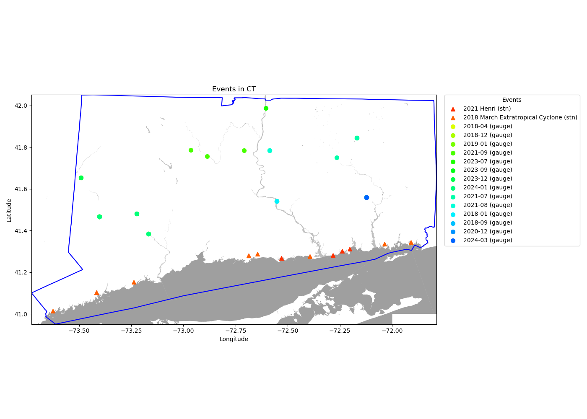

# Report
This document is the final report including an introduction to the method and a detailed discussion of the result. 

## Goal
This project focus on developing an algorithm for automated assessment of inland flooding from satellite observations. Specifically, this algorithm collects satellite images corresponding to pre-, during-, and post-flood events and applies the K-means clustering technique to identify flooded areas. While the project initially targeted Maine, it has been expanded to include other states with similar flood characteristics. The ultimate goal is to enhance flood detection capabilities, providing insights that can be applied to flood detection using drone measurements.

## Data
The approach integrates the datasets described in Table 1 below:
| **Table 1: Introduction to the Datasets** | | | | |
|---|---|---|---|---|
| **Name** | **Related Link** | **Explanation** | **Format** | **Resources** |
| [High-water marks](https://www.usgs.gov/special-topics/water-science-school/science/high-water-marks-and-flooding) | [STN flood event data](https://stn.wim.usgs.gov/STNDataPortal/) | validated flood event observations from United States Geological Survey | CSV | [Report>](REPORT.md) [Guide>](GUIDE.md) Data> |
| [High-water levels](https://www.weather.gov/aprfc/terminology) | [USGS Water Data Services](https://waterdata.usgs.gov/nwis/rt) | real-time gauge water levels above moderate flood stage | CSV | [Report>](REPORT.md) [Guide>](GUIDE.md) Data> |
| [Sentinel-2 satellite images](https://developers.google.com/earth-engine/datasets/catalog/sentinel-2) | [Sentinel-2 Level-2A](https://developers.google.com/earth-engine/datasets/catalog/COPERNICUS_S2_SR_HARMONIZED) | satellite images corresponding to the areas of interest and timeframes defined by high-water marks and levels | GeoTIFF | [Report>](REPORT.md) [Guide>](GUIDE.md) Data> |
| [Cloud and Shadow](https://developers.google.com/earth-engine/tutorials/community/sentinel-2-s2cloudless) masks | [s2cloudless](https://developers.google.com/earth-engine/tutorials/community/sentinel-2-s2cloudless) | cloud and shadow pixels to be dropped | GeoTIFF | [Report>](REPORT.md) [Guide>](GUIDE.md) Data> |
| [Normalized Difference Water Index](https://eos.com/make-an-analysis/ndwi/) masks | [Example](https://medium.com/@melqkiades/water-detection-using-ndwi-on-google-earth-engine-2919a9bf1951) | water body pixels defined by NDWI index to refine the algorithm's accuracy | GeoTIFF | [Report>](REPORT.md) [Guide>](GUIDE.md) Data> |
| Flowlines | National Hydrography Dataset | Flowing water data used to enhance analysis and improve algorithm performance | Shapefile | 1.[Report>](REPORT.md) [Guide>](GUIDE.md) Data> |

## Method
1. Collect flood event data from two sources: high-water marks available through the USGS STN Flood Event Data Portal and high-water levels extracted from real-time gauge data provided by USGS Water Data Services;
2. Collect satellite images corresponding to pre-, during-, and post-flood event data;
3. Apply the K-means clustering technique to identify flooded areas

## Result

### Flood Event Data
| **Table 2: Flood Event Data Summary** | | |
|---|---|---|
| \ | **High-water marks** | **High-water levels** |
| **overview** | 889 observations | 218 observations |
| **top 3 counts by event** | 2023 July MA NY VT Flood 641 2018 March Extratropical Cyclone 115 2018 January Extratropical Cyclone 81| 2023-12 64 2023-07 27 2024-01 18 |
| **top 3 counts by state** | VT 646 MA 282 CT 72 | CT 57 VT 56 ME 40 |
| **countplot** | |  |
| **map based on top 3 by state** |  |  |
| **Note** | No exact dates are assigned to the flood events. Therefore, to collect and distinguish the satellite imagery before/during/after flood events, I explored online reports to define the dates. This process will be included in [GUIDE](GUIDE.md). | High-water levels depends on the moderate flood stage threshold which can be adjusted. |
| **Analysis** | In Vermont, the 2023 July MA NY VT Flood event has the highest number of data points. Many of these points are clustered close to each other, with minimal overlap between STN and gauge data. | In Connecticut, there are fewer data points. STN data points are primarily located along the coast, while gauge data points are concentrated near the river. There is no overlap between the STN and gauge data. |

### National Hydrography Dataset and NDWI 
To enhance the analysis of Sentinel-2 images and help improve the performance on KMeans clustering algorithms, the flowlines from National Hydrography Dataset are collected. The command `make nhd` plots the flowlines on the filtered Sentinel-2 image dataset (25 images during flood events). Below is an example of plotting the NHD flowline on top of one Sentinel-2 image.
#### 44909

#### TMVC3_1890

- In this figure, the added flowlines help distinguish the flooded area, especially in the regions where the land cover is similar to the flood-affected areas. 

#### NDWI threshold testing on 44909

### Satellite Imagery Data (Sentinel 2)
In this section, I added the results for two flood event observations.

#### 44909
Below is the plotted figure before optimization.

Below is the plotted figure after optimization (pca).

Below is the plotted figure after optimization (ndwi as feature and pca). 

#### TMVC3_1890
Below is the plotted figure before optimization.

Below is the plotted figure after optimization (pca).

Below is the plotted figure after optimization (ndwi as feature and pca). 
