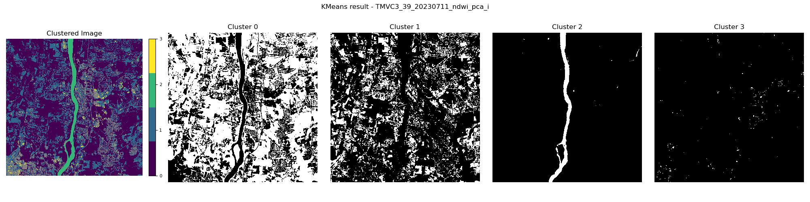
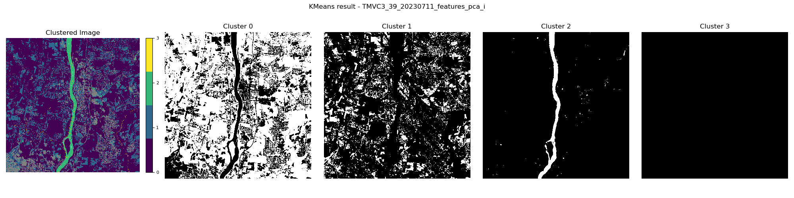

# Report - Automated Assessment of Inland Flooding From Satellite Observations
This project focuses on developing an algorithm for automated assessment of inland flooding from satellite observations. Specifically, this algorithm collects satellite images captured before/during/after flood events and applies the K-means clustering algorithm to automatically identify flooded areas. 

Satellite data, particularly from Sentinel-2 with its 10-meter resolution, provides a powerful tool for observing and analyzing flood events in detail. While weather conditions such as heavy cloud cover during flood events can be challenging,the use of satellite imagery and machine learning techniques remains valuable. Satellite imagery offers broad and near real-time coverage that helps enhance the ability to monitor and assess flooded areas. Moreover, this approach seeks to offer insights into enhancing flood detection using drone-based measurements which are not affected by cloud cover.

**Area of Interests**: The project initially focused on Maine. However, due to limited flood event observations in Maine, it has been expanded to include other states in the New England Region (primarily Vermont) which shares similar flood characteristics.

## 1. Method
1. Collect flood event observations from two sources: high-water marks available through the USGS STN Flood Event Data Portal and high-water levels extracted from real-time gauge water levels provided by USGS Water Data Services;
2. Collect satellite images captured before, during, and after flood event observations;
3. Apply the K-means clustering algorithm to identify flooded areas.

## 2. Data
The approach integrates the datasets described in the table below:
| **Name** | **Source** | **Description** | **Format** | **Links** |
|---|---|---|---|---|
| [High-water marks](https://www.usgs.gov/special-topics/water-science-school/science/high-water-marks-and-flooding) | [STN flood event data](https://stn.wim.usgs.gov/STNDataPortal/) | validated flood event observations from USGS | CSV | [Report>](REPORT.md) [Guide>](GUIDE.md) [Data>](https://drive.google.com/drive/folders/1iFKHeHfNnRrpxUlsN3PIxYGxEh9IeB3n?usp=sharing) |
| [High-water levels](https://www.weather.gov/aprfc/terminology) | [USGS Water Data Services](https://waterdata.usgs.gov/nwis/rt) | real-time gauge water levels above moderate flood stage | CSV | [Report>](REPORT.md) [Guide>](GUIDE.md) [Data>](https://drive.google.com/drive/folders/1iFKHeHfNnRrpxUlsN3PIxYGxEh9IeB3n?usp=sharing) |
| [Sentinel-2 images](https://developers.google.com/earth-engine/datasets/catalog/sentinel-2) | [Sentinel-2 Level-2A](https://developers.google.com/earth-engine/datasets/catalog/COPERNICUS_S2_SR_HARMONIZED) | satellite images corresponding to the areas of interests and timeframes defined by high-water marks and levels | GeoTIFF | [Report>](REPORT.md) [Guide>](GUIDE.md) [Data>](https://drive.google.com/drive/folders/1iFKHeHfNnRrpxUlsN3PIxYGxEh9IeB3n?usp=sharing) |
| [Cloud and Shadow](https://developers.google.com/earth-engine/tutorials/community/sentinel-2-s2cloudless) masks | [s2cloudless](https://developers.google.com/earth-engine/tutorials/community/sentinel-2-s2cloudless) | cloud and shadow pixels to be removed | GeoTIFF | [Report>](REPORT.md) [Guide>](GUIDE.md) [Data>](https://drive.google.com/drive/folders/1iFKHeHfNnRrpxUlsN3PIxYGxEh9IeB3n?usp=sharing) |
| [NDWI](https://eos.com/make-an-analysis/ndwi/) masks | [NDWI tutorial](https://medium.com/@melqkiades/water-detection-using-ndwi-on-google-earth-engine-2919a9bf1951) | water body pixels defined by Normalized Difference Water Index | GeoTIFF | [Report>](REPORT.md) [Guide>](GUIDE.md) [Data>](https://drive.google.com/drive/folders/1iFKHeHfNnRrpxUlsN3PIxYGxEh9IeB3n?usp=sharing) |
| [Flowlines](https://www.usgs.gov/ngp-standards-and-specifications/national-hydrography-dataset-nhd-data-dictionary-feature-classes) masks | [National Hydrography Dataset](https://www.usgs.gov/national-hydrography/access-national-hydrography-products) | routes that make up a linear surface water drainage network | Shapefile | [Report>](REPORT.md) [Guide>](GUIDE.md) [Data>](https://drive.google.com/drive/folders/1iFKHeHfNnRrpxUlsN3PIxYGxEh9IeB3n?usp=sharing) |

_Note: The [data](https://drive.google.com/drive/folders/1iFKHeHfNnRrpxUlsN3PIxYGxEh9IeB3n?usp=sharing) folder structure and contents are explained in [GUIDE](GUIDE.md)._

## 3. Result
This section presents the work and findings organized into five key parts:
- [3.1 Flood Event Observations (High-Water Marks)](#31-flood-event-observations-high-water-marks)
- [3.2 Flood Event Observations (High-Water Levels)](#32-flood-event-observations-high-water-levels)
- [3.3 Sentinel-2 Natural Color Imagery](#33-sentinel-2-natural-color-imagery)
- [3.4 Cloud Masks, NDWI Masks, and Flowline Masks](#34-cloud-masks-ndwi-masks-and-flowline-masks)
- [3.5 KMeans Clustering Algorithm](#35-kmeans-clustering-algorithm)

### 3.1 Flood Event Observations (High-Water Marks)
High-water marks are validated flood event observations published by the USGS. The original dataset has 53 attributes and 3502 observations. Only 7 of these attributes and 889 observations are selected for the following reason:
- This project focuses on the locations and dates of flood event observations so attributes such as `hwmTypeName` and `verticalDatumName` are excluded as they are not directly relevant;
- Some of the flood events, such as the `1991 October Extratropical Cyclone`, occurred before the availability of Sentinel-2 imagery which has only been available since 2015;
- Some locations (`latitude`, `longitude`) have multiple high-water marks with different `elev_ft` measured. The detail is included in [GUIDE](GUIDE.md)

#### 3.1.1 Dataset Overview

Below is a table summarizing the key characteristics of the filtered high-water marks:
|**Atribute**|**Count of unique values**|**Top 3 event**|**Count**|**Top 3 state**|**Count**|
|-|-|-|-|-|-|
|id event state county latitude longitude note source|889 5 6 28 863 860 837 1|2023 July MA NY VT Flood 2018 March Extratropical Cyclone 2018 January Extratropical Cyclone|641 115 81|VT MA CT|590 262 15|

**_Insight_**
- The table indicates that all six states in the New England region were affected by five significant flood events, but the impact varied across the states.To explore the distribution of high-water marks across different states and events, visualization techniques including countplots and maps are necessary.

#### 3.1.2 Dataset Visualization
Below are two figures illustrating the distribution of high-water marks:
|**Countplot**|**VT map (Top 1 state)**|
|-|-|
| The countplot illustrates the distribution of flood event observations in each state. It's evident that Vermont has the highest number of observations, primarily from the `2023 July MA NY VT Flood` event (547 observations). In contrast, Maine, the initially targeted state, has only 6 observations.| The map represents the spatial distribution of high-water marks (triangle markers) in Vermont which has the highest number of observations. A significant number of high-water marks are clustered closely together and the majority is from the flood event `2023 July MA NY VT Flood`.|

**_Insight_**
- The distribution of high-water marks suggests that the `2023 July MA NY VT Flood` event in Vermont is likely the most suitable dataset for further analysis and satellite imagery collection since it has the largest number of observations. However, the close proximity of some high-water marks presents a challenge for satellite imagery collection, as the buffer regions around these points may significantly overlap. This issue will be carefully considered during the satellite imagery collection process.

#### 3.1.3 Flood Event Date Assignment
This dataset has 5 flood events: `2018 January Extratropical Cyclone`, `2018 March Extratropical Cyclone`, `2021 Henri`, `2023 July MA NY VT Flood`, and `2023 December East Coast Cyclone`. However, it lacks precise timeframes, which are crucial for collecting corresponding satellite imagery. To resolve this, specific dates are identified through online reports and the reports are compared with the visualization in Section 3.1.2. 

Below is the table with the dates assigned based on online reports:
|**Event**|**Date**|**Discussion**|
|-|-|-|
|[2018 January Extratropical Cyclone](https://en.wikipedia.org/wiki/January_2018_North_American_blizzard)|2018-01-02 to 2018-01-06|According to the report from Wikipedia, Massachusetts was the most affected state during the event, with both Maine and New Hampshire experiencing significant coastal flooding. The countplot in Section 3.1.2 shows that 81 observations are from `2018 January Extratropical Cyclone` in Massachusetts. However, no observation is in Maine or New Hampshire.|
|[2018 March Extratropical Cyclone](https://en.wikipedia.org/wiki/March_1%E2%80%933,_2018_nor%27easter)|2018-03-01 to 2018-03-05|According to the report from Wikipedia, Connecticut, Rhode Island, Massachusetts, and Maine were affected by this event, with Connecticut and Massachusetts experiencing significant flooding. However, the countplot shows that New Hampshire was affected also.|
|[2021 Henri](https://www.nhc.noaa.gov/data/tcr/AL082021_Henri.pdf)|2021-08-15 to 2021-08-23|According to the report published by NOAA, "flooding was extensive, particularly in ...and Connecticut." This is also reflected in the countplot. Only Connecticut has 7 observations from `2021 Henri`.|
|[2023 July MA NY VT Flood](https://www.weather.gov/btv/The-Great-Vermont-Flood-of-10-11-July-2023-Preliminary-Meteorological-Summary)|2023-07-10 to 2023-07-11|According to the report in Vermont from NOAA, Vermont experienced castastrophic flash flooding and river flooding during this event, with the affected areas widely spread across the state. Additionally, [Figure 4](https://www.weather.gov/images/btv/events/July2023Flood/Figure4.PNG) shows that Massachusetts was also impacted. These observations are consistent with the countplot and the Vermont map presented in Section 3.1.2.|
|[2023 December East Coast Cyclone](https://cw3e.ucsd.edu/wp-content/uploads/2023/12/20Dec2023_Summary/20231218EastCoast.pdf)|2023-12-17 to 2023-12-18|According to the report from Scripps Institution of Oceanography, widespread moderate to major flooding occurred across the New England Region, with Flash Flood Warnings and Flood Warnings active in most states. However, the countplot reveals that only Vermont has recorded high-water marks for the `2023 December East Coast Cyclone`. This discrepancy arises because high-water mark datasets are not immediately available after flood events. The collected high-water marks undergo investigation and validation before being published. It is expected that in the near future, additional high-water marks from Maine and other affected areas will become available for analysis.|

### 3.2 Flood Event Observations (High-Water Levels)
The dataset of high-water levels has 9 attributes and 218 observations. This dataset is not directly downloaded. The collection of high-water levels consists of three steps:
1. Collect NWSLI identifiers and descriptions for the gauges from NOAA
    - NOAA provides charts with National Weather Service Location Identifiers (NWSLI) for gauges in each state and the NWSLI is used to extract the gauge information in step 2 

2. Identify corresponding USGS IDs and gather flood-related information such as flood stage threshold and flood impacts
    - The National Weather Service (NWS) assigns flood stages to gauge water levels. From one of its programs named the National Water Prediction Service, flood stage thresholds and flood impact information for each gauge are found. Additionally, this service includes USGS IDs used to extract real-time water level data from the USGS Water Data Service
    - It’s important to note that not all USGS stations have corresponding NWS flood stage thresholds. Some gauges in the USGS system may not be included in the NWS system. ([Example](https://waterwatch.usgs.gov/index.php?r=me&m=flood&w=table))
    - Flood stage thresholds can change over time due to changes near the gauge. As a result, the collected high-water levels may be updated periodically if using this method

3. Collect real-time water levels using USGS IDs and compare with moderate flood stage thresholds to identify observations where water levels exceed the moderate flood stage.

#### 3.2.1 Step-by-Step Example
1. [ME gauge list](https://hads.ncep.noaa.gov/charts/ME.shtml);
2. [Flood-related Information - Kennecbec River at Augusta Information with NWSLI ASTM1](https://water.noaa.gov/gauges/ASTM1);
3. [Water Levels - Kennebec River at Augusta with NWSLI ASTM1 and USGSID 01049320](https://waterdata.usgs.gov/monitoring-location/01049320/#parameterCode=00065&period=P7D&showMedian=false) and constructed [URL to retrieve data between 2017-03-28 and 2018-05-23](https://nwis.waterservices.usgs.gov/nwis/iv/?sites=01049320&parameterCd=00065&startDT=2017-03-28T00:00:00.000-05:00&endDT=2018-05-23T23:59:59.999-04:00&siteStatus=all&format=rdb) (date range set for illustration only).

#### 3.2.2 Dataset Overview
Below is a table summarizing the key characteristics of the high-water levels:
|**Atribute**|**Count of unique values**|**Top 3 event**|**Count**|**Top 3 state**|**Count**|
|-|-|-|-|-|-|
|id event event_day state county latitude longitude note source|218 25 83 6 34 68 68 60 1| 2023-12 2023-07 2024-01|64 27 18|CT VT ME|57 56 40|

**_Insight_**
- The table indicates that all six states in the New England region were affected by 25 flood events. However, the total number of high-water levels is 218. When compared to the 889 flood event observations discussed in Section 3.1, this number is relatively low. To understand more about the distribution of high-water marks, visualization techniques including countplot and map are added.

#### 3.2.3 Dataset Visualization
Below are two figures illustrating the distribution of high-water marks:
|**Countplot**|**VT map (Top 1 state)**|
|---|---|
|  The countplot shows the distribution of flood event observations across each state. The `2023-07` event in Vermont has the highest number of observations (20) across all states. |  The map represents the spatial distribution of high-water levels in Connecticut which has the highest number of observations. All high-water levels (circle) are located inland, along the river. |

**_Insight_**
- Comparison between high-water levels and high-water marks:
    - High-water levels are mostly located in inland areas. However, high-water marks are located in coastal and inland areas. The overlap between them is minimal.
    - High-water levels help fill gaps in the data. Some states affected by specific events, as discussed in the online reports, are not reflected in the high-water marks but they are captured in the high-water levels. For example, although `2023 December East Coast Cyclone` was reported to have impacted most states in the New England region, this is not evident in the distribution of high-water marks. However, the countplot of high-water levels shows that `2023-12` event (red) is present across all states, providing a more comprehensive picture of the affected areas.
    - **_Note_**: For high-water levels, the `event` attribute is defined by extracting the year and month (YYYY-MM) from the `event_day` attribute (YYYY-MM-DD). As a result, some observations categorized under the `2023-12` event may not actually fall within the specific period of the `2023 December East Coast Cyclone` (December 17-18, 2023). For instance, one high-water level with the ID `YTCC3_51` is recorded on 2023-12-11, which happened before the cyclone event. This indicates that careful consideration is needed when interpreting the data, as not all observations within the same month are related to the same flood event.

### 3.3 Sentinel-2 Natural Color Imagery
Given that weather conditions during flood events are often poor, having a large number of flood event observations is important for collecting high-quality images. In this project, both high-water marks and high-water levels are utilized to collect Sentinel-2 imagery and corresponding masks. 1,107 flood event observations are used to collect images. Based on the analysis of flood event data, most images will be associated with 2023 July flood event (641 high-water marks from `2023 July MA NY VT Flood` and 27 high-water levels from `2023-07`). 

The Sentinel-2 satellite is selected from various satellites because of its natural color visualization option and 10-meter resolution. It provides the high-quality input images for K-means clustering algorithm in the next step. To achieve the natural color visualization, the combination of bands B04, B03, and B02 is selected, as introduced in the [Sentinel Hub Guide](https://custom-scripts.sentinel-hub.com/custom-scripts/sentinel-2/composites/).

#### 3.3.1 Introduction
 Initially, 379 images were downloaded using Google Earth Engine API. After necessary filtering steps, the dataset is refined to include 69 high-quality natural color images, captured before/during/after the 2023 July Flood Event. These 69 images belong to 25 flood event observations. The filtering process is illustrated below:

#### 3.3.2 Image Exploration
10 of these images have significant flooded areas through visual inspection. The IDs of these images are **44909**, **44929**, **45067**, **45237**, **45321**, **45358**, **45427**, **45501**, **MNTM3_114**, and **TMVC3_39**. 

Below is a table showing some of the collected images grouped by their ids (representing flood event observation):
| **ID** | **Figure** | **Note** |
|---|---|---|
| **44909** |  | Ideal flood event observation (high-water mark) with notable flooded areas and numerous bright pixels, likely representing urban structures and roads |
| **45358** |  | Ideal flood event observation (high-water mark) with notable flooded areas and less bright pixels |
| **45501** |  | Ideal flood event observation (high-water mark) with notable flooded areas and fewest bright pixels |
| **TMVC3_39** |  | Ideal flood event observation (high-water level) with notable flooded areas and significant noise from color similarity and inconsistent colors across the image |
| **CLMM3_97** | | Cloud cover issue: The image collected on 2023-07-06 is excluded. In Google Earth Engine, the cloud cover threshold (`CLOUDY_PIXEL_PERCENTAGE`) is applied to the entire image to filter out images with cloud cover below the threshold. As a result, an image may have a low overall cloud percentage but the targeted region still have significant cloud cover. |
| **AUBM1_59** || Color similarity issue: Even though the river color is brown, the similarity in color between the river and the surrounding non-water areas indicates that this image may not be ideal for this project. |

#### 3.3.3 Dataset Visualization
To understand the distribution of the ideal image dataset, the countplot and map are utilized:
|**Countplot**|**VT map (Top 1 state)**|
|-|-|
| The countplot groups the images by states and period labels (before/during/after flood). It shows the distribution of images across each state. The large number of Sentinel-2 images for Vermont for 2023 July flood event is reasonable when considering the high number of flood event observations for 2023 July flood event in Vermont. (Figures in Section 3.1.2)| The map illustrates the spatial distribution of image IDs (representing the flood event observation). When compared with the Vermont flood event map in Section 3.1.2, it becomes evident that this distribution primarily includes observations in the southern part of the state. In contrast, the map in Section 3.1.2 shows that the 2023 July flood event affected both northern and southern regions of Vermont.|

**_Insight_**
- The large number of Sentinel-2 images for Vermont for 2023 July flood event is reasonable when considering the large number of flood event observations for 2023 July flood event in Vermont. (Figures in Section 3.1.2)
- The map illustrates the spatial distribution of flood event observation IDs. When compared with the Vermont flood event map in Section 3.1.2, it becomes evident that this distribution primarily includes observations in the southern part of the state. In contrast, the map in Section 3.1.2 shows that the 2023 July flood event affected both northern and southern regions of Vermont. This difference in the distribution pattern is interesting and it should be further investigated to understand the reason.

### 3.4 Cloud Masks, NDWI Masks, and Flowline Masks

#### 3.4.1 Cloud Masks from Google Earth Engine
When downloading Sentinel-2 images, [s2cloudless](https://developers.google.com/earth-engine/tutorials/community/sentinel-2-s2cloudless) is utilized to collect cloud and shadow masks. This step is crucial for excluding the cloud and shadow pixels which are irrelevant pixels. Pixels that are not cloud or shadow are considered as valid pixels for K-means clustering algorithm. 

However, the cloud masked created using the s2cloudless algorithm can be influenced by high-reflectance surfaces. Surfaces such as certain urban materials that reflect a great amount of sunlight can cause the s2cloudless algorithm to incorrectly identify them as clouds. The [s2cloudless tutorial](https://developers.google.com/earth-engine/tutorials/community/sentinel-2-s2cloudless) published by Google Earth Engine introduces various parameters that can be adjusted to improve the accuracy in classifying cloud and shadow. 

Due to time constraints, such optimization is not implemented in this project. Additionally, since the primary focus is on flooded areas, the minor inaccuracies resulting from incorrectly dropped non-cloud and non-shadow pixels due to high-reflectance surfaces are not expected to significantly impact the overall performance. Below are two sets of images illustrating the performance of s2cloudless approach in classifying cloud and shadows.Some of the road and urban structures are mistakenly considered as cloud or shadow (represented by white pixels).

| \ | **True Color** | **Cloud Mask** |
|---|---|---|
| **44909** |  |  |
| **45358** |  |  |

#### 3.4.2 NDWI Masks from Google Earth Engine
To help analyze the flooded areas and optimize the performance of K-means clustering algorithm, Normalized Difference Water Index is introduced. Based on the [explanation from EOS Data Analytics](https://eos.com/make-an-analysis/ndwi/), the NDWI is calculated using the reflectance values captured by specific bands in satellite data. For Sentinel-2 data, the equation is **NDWI = (Band 3 – Band 8)/(Band 3 + Band 8)**. Band 3 (corresponding to the green portion of the visible light spectrum) is reflected by water surfaces and Band 8 (corresponding to near-infrared light) is strongly reflected by vegetation and soil but not by water. This difference helps to clearly highlight water bodies in the images.

However, NDWI results can be impacted by high-reflectance surfaces such as certain urban structures. These high-reflectance surfaces may be mistakenly classified as water. To reduce the misclassification, carefult selection of the NDWI threshold is necessary.

NDWI mask is collected when downloading Sentinel-2 images. After that, the NDWI threshold is selected by comparison. Below is a table showing the threshold selection. The selected threshold is **-0.1**.
| \ | **NDWI thresholds**| **True Color** |
|---|---|---|
| **44909** |  When the threshold is set to -0.15, some urban structures are mistakenly classified as water. The difference between thresholds of -0.1 and -0.05 is relatively small; however, at -0.05, more noisy pixels are eliminated, though it also results in the removal of some actual water areas. |  |
| **45358** |  In this figure, a further comparison between thresholds of -0.1 and -0.05 shows that -0.05 is less ideal, as it removes a great portion of actual water areas.|  |
#### 3.4.3 Flowline Masks from National Hydrography Dataset
To better identify flooded areas in complex environments and enhance the K-means algorithm by directing its focus toward water areas rather than non-water areas with similar brown color, the flowline dataset is also introduced. [Flowlines](https://www.usgs.gov/ngp-standards-and-specifications/national-hydrography-dataset-nhd-data-dictionary-feature-classes) are linear representations of flowing water features collected from the [National Hydrography Dataset](https://www.usgs.gov/national-hydrography/national-hydrography-dataset). However, using the entire dataset can introduce unnecessary noise. Based on the visual inspection, the focus should be on major rivers. 

Currently, major rivers are defined by the conditions `ftype == 558` and `lengthkm >= 0.6`. However, this method is not an effective approach since it results in fragmented lines and the inclusion of irrelevant flowlines. Despite these challenges, this flowline mask is still used as part of the experimental test. 

Below is a comparison between all flowlines and the selection of major rivers. 

| \ | **Flowline**| **Major River** |
|---|---|---|
| **44909** |  |  |

### 3.5 KMeans Clustering Algorithm
To automate the assessment of flooded areas, I select the K-means clustering algorithm, a commonly used method in image segmentation. The decision to use K-means clustering is based on three crucial factors: the small dataset size (69 images), the absence of ground truth for the flooded areas, and the unique visual characteristics of the flooded areas (brown water bodies caused by sediment). K-means clustering algorithm groups data points based on similarity. When only image data is used, this similarity is based on color; when additional features are introduced, the similarity is calculated based on the combination.

First, the default setting is executed in each image. `StandardScaler` is applied before K-means clustering algorithm to standardize the image color channels. This standardization not only speeds up convergence but also improves the accuracy and consistency of the clustering results. K-means is initialized with 3 clusters determined by visual inspection and the initialization method is set to`k-means++`. 

During the optimization phase, Principal Component Analysis (PCA), a dimensionality reduction technique that reduces noise while capturing the most important information, is applied. The [tutorial from Medium](https://towardsdatascience.com/k-means-and-pca-for-image-clustering-a-visual-analysis-8e10d4abba40) provides additional explanation of how to comebine K-means and PCA. Additionally, additional masks are introduced as features.Each image undergoes three types of optimization. In this process, the selection of the optimal number of PCA components and clusters is guided by the explained variance and the elbow method.

Three types of optimizations are:
- Apply Principle Component Analysis to image data;
- Add flowline mask as a feature and apply Principle Component Analysis to the combination of flowline mask and image data;
- Add NDWI mask as a feature and apply Principle Component Analysis to the combination of NDWI mask and image data;
- Add both flowline mask and NDWI mask as features and then apply Principle Component Analysis to the combination of flowline mask, NDWI mask, and image data.

The following sections 3.6.1 to section 3.6.4 are the results of different images with flooded areas. These four images are selected because they are images with notable flooded areas and the distinct environmental characteristics, as discussed in Section 3.3.2 Image Exploration.

#### 3.5.1 Result - ID: 44909
| \ | **True Color**| **Result** |
|---|---|---|
| **Default** |  |  In the default K-means clustering result, Cluster 1 includes the flooded area. However, some of other areas such as roads and urban structures are also considered as the flooded area. |
| **PCA** |  |  Principle Component Analysis is applied to reduce the noise. Cluster 1 includes the flooded area. PCA effectively reduces the impact of noisy or irrelevant data.|
| **Flowline with PCA** |  |  Under this combination, the results are less accurate compared to when PCA is applied to the image data alone. Cluster 2 contains few pixels that it is not possible to display them effectively. |
| **NDWI with PCA** |  |   This result is the most accurate and effective outcome. Cluster 2 is the flooded area. |
| **Flowline and NDWI with PCA** |  |  This outcome is similar to the result obtained using the flowline mask with PCA.  |

#### 3.5.2 Result - ID: 45358
| \ | **True Color**| **Result** |
|---|---|---|
| **Default** |  |  Compared with the image with id 44909, this image has less urban structures. This is also reflected in the default K-means clustering result. Cluster 1 includes the flooded area and it has less noisy pixels. |
| **PCA** |  |  With PCA applied, Cluster 2 includes the flooded area and the noise is reduced slightly. |
| **Flowline with PCA** |  |  This result is the worst one. Compared to the default result, more noisy pixels are included. |
| **NDWI with PCA** |  |  The result is greatly improved. However, comparing this with PCA only result, this approach introduces new noisy pixels on the top left part. |
| **Flowline and NDWI with PCA** |  |  This result is similar to default result. |

#### 3.5.3 Result - ID: 45501
| \ | **True Color**| **Result** |
|---|---|---|
| **Default** |  |  Cluster 1 includes the flooded area. Some non-water areas with similar color are also included. |
| **PCA** |  |  When PCA is applied, the improvement is minimal. |
| **Flowline with PCA** |  |  The optimized result is similar to the result from PCA alone. |
| **NDWI with PCA** |  |  The flooded area (Cluster 2) is extracted more accurately in Cluster 2. |
| **Flowline and NDWI with PCA** |  |  The identified flooded area is similar to the results obtained from NDWI with PCA. However, it also outputs Cluster 1, which is difficult to define as a meaningful area. |

#### 3.5.4 Result - ID: TMVC3_39
| \ | **True Color**| **Result** |
|---|---|---|
| **Default** |  |  This image includes many more noisy pixels; therefore, it's more challenging. Cluster 2 includes the flooded area. However, many other pixels are also included. |
| **PCA** |  |  When PCA is applied, there's no visual difference. |
| **Flowline with PCA** |  |  The improvement is also minimal after adding flowlines as a feature. |
| **NDWI with PCA** |  |   With NDWI and PCA applied together, the result is greatly improved. |
| **Flowline and NDWI with PCA** |  |  The result is similar to the previous result; however, adding flowline introduces additional noisy pixels. |

#### 3.5.5 Comparison between Targeted Cluster (Flooded Area) and NDWI
Based on the analysis of the clustered images, the combination of NDWI mask and PCA outputs the best result. Therefore, further analysis is conducted by comparing the best result and NDWI mask. 

Because optimization of K-means clustering algorithms are applied to images individually, the selected optimal `n_components` and `n_clusters` clusters can vary between images. To automatically identify the cluster representing the flooded area, NDWI mask is used. The overlap between the NDWI mask and each cluster is calculated, with the cluster showing the highest overlap being identified as the flooded area. Below is comparison between NDWI and the best result. 

| **S2** | **NDWI**| **Best Cluster** | **Pixel Count** |
|---|---|---|---|
|  |  |  Compared to NDWI mask, the noisy pixels and the water bodies with clear water in the best result are reduced. The reduction is also reflected in the number of pixels. | NDWI pixels: 37389 Targeted Cluster pixels: 36039 |
|  |  |  Compared to NDWI mask, Cluster 2 reduces the water bodies with clear water. However, new nosiy pixels are introduced. The number of pixels are similar. | NDWI pixels: 36823 Targeted Cluster pixels: 36715 |
|  |  |  Compared to the NDWI mask, the number of flooded area pixels in the best result is reduced. However, this reduction is not ideal, as it includes a decrease in the flooded river water on the top right part of the image. | NDWI pixels: 3035 Targeted Cluster pixels: 2997 |
|  |  |  Compared to NDWI mask, the high-reflectance surface pixels in the best result are reduced. | NDWI pixels: 46531 Targeted Cluster pixels: 42918 |

#### 3.5.6 Explained Variance and Elbow Method
During the optimization process, the number of components (`n_components`) in PCA and the number of clusters (`n_clusters`) in the K-means clustering algorithm are tested with different values to determine the optimal configuration.

For PCA, the goal is to identify the minimum number of components that captures at least 90% of the variance in the data. After determining this optimal number of components, PCA is applied to the input data.

For K-means clustering, a range of cluster numbers from 2 to 6 is tested. The elbow method is used to identify the optimal number of clusters (`n_clusters`). Inertia (sum of squared distances between each point and its closest cluster center) is calculated for each `n_clusters`. The optimal number of clusters is determined at the elbow point, where the rate of decrease in inertia begins to slow.

The best combination of n_components and n_clusters is used to optimize the K-means clustering algorithm.

| \ | **Natural Color Image** |**Explained Variance**| **Elbow Method** | **Note** |
|---|---|---|---|---|
| **44909** |  | |  | n_components = 2 n_clusters = 4 |
| **45358** |  | |  | n_components = 2 n_clusters = 3 |
| **45501** |  | |  | n_components = 2 n_clusters = 4 |
| **TMVC3_39** |  | |  | n_components = 2 n_clusters = 4 |

## 4. Discussion and Future Work

### 4.1 Discussion
The New England region has experienced a significant number of recent flood events, with 1,107 observations highlighting the challenges of inland and coastal flooding. Therefore, developing effective methods for assessing flooded areas is critical. However, the weather conditions during flood events, particularly heavy cloud cover, pose challenges in collecting a large number of high-quality Sentinel-2 images. Additionally, the timing of Sentinel-2 image captures may not always align with the peak of flood events, further limiting the availability of high-quality satellite images. Based on these flood event observations, 379 images are collected, and only 69 of those are ideal.

The analysis of the default K-means clustering algorithm across various images reveals that environmental characteristics significantly influence the results. When the features in an image are primarily flooded areas and green land, the default K-means algorithm can extract the majority of the flooded regions with relatively small noisy pixels. However, in more complex environments, optimizing the algorithm becomes crucial, as the flooded areas are more likely to be mixed with other noisy pixels.

Different optimization approaches have different results. For instance, when combining the NDWI mask with PCA, NDWI tends to dominate the outcome, having a strong influence on the result. Additionally, the same optimization technique can produce different effects depending on the environmental characteristics of the images. These results need to further investigated to understand the process and improve the optimization approach used.

### 4.2 Future Work
There're many aspects that can be further explored and improved.

Firstly, the current approach to extracting major rivers from flowline datasets can be refined. Samuel Roy, a scientist from USGS, suggests that stream order selection is helpful in identifying major rivers. By incorporating this modification, the flowline mask used as a feature in the optimization process might see improvements. 

Secondly, the optimization process can be significantly improved by exploring various ways to combine the features and techniques currently in use, such as NDWI (Normalized Difference Water Index) and flowline data, along with StandardScaler and PCA (Principal Component Analysis). Each combination of these elements can produce different results, and selecting the optimal combination is crucial for enhancing the model's performance.

Thirdly, one of the initial datasets included in this proposal is the Digital Elevation Model (DEM). Because flood event observations often come with elevation values, integrating DEM data can provide valuable insights. However, high-water marks from the STN (Short-Term Network) dataset need to be carefully processed. Some locations may have multiple high-water marks with different elevation values. Discussion with a professional will be necessary to ensure accuracy in the analysis. 

### Acknowledgement
Great thanks to my supervisor, Philip Bogden, for his guidance and support throughout my research, especially in helping me navigate the challenges I faced.

Great thanks to Samuel Roy from USGS who provided many professional and valuable advices about the data sources and methodology. 

### Reference
#### Data
- [STN flood event data](https://stn.wim.usgs.gov/STNDataPortal/)
- [USGS Water Data Services](https://waterdata.usgs.gov/nwis/rt)
- [National Water Prediction Service](https://water.noaa.gov/#@=-96.401081,38.1465724,3.3479233&b=topographic&g=obsFcst,1!1!1!1!1!1!1!1!1!1!1!1!1!1!1!0!0!0!0!0,0.5,1!1!1!1!0,0,0&ab=0,0,#D94B4A,1,1,1,#cccccc,1,0,0,#B243B1,1,0,0,#98E09A,1&a=hydrologic,0.35&s=0,0,0.9,0.9&n=false,#72afe9,0.9,0,0.9,0,0.9&p=false,0.75,0,7,0,1,2024,8,15,0&d=0,0,1,1,1,1,1,1,#006EFF,1,#006EFF,1,#006EFF&q=)
- [Sentinel-2 Level-2A](https://developers.google.com/earth-engine/datasets/catalog/COPERNICUS_S2_SR_HARMONIZED)
- [National Hydrography Dataset](https://www.usgs.gov/national-hydrography/national-hydrography-dataset)

#### Paper
- [A multi-sensor approach for increased measurements of floods and their societal impacts from space](https://www.nature.com/articles/s43247-023-01129-1)
- [Remote sensing for flood inundation mapping using various processing methods with Sentinel-1 and Sentinel-2](https://isprs-archives.copernicus.org/articles/XLVIII-M-1-2023/339/2023/isprs-archives-XLVIII-M-1-2023-339-2023.pdf)