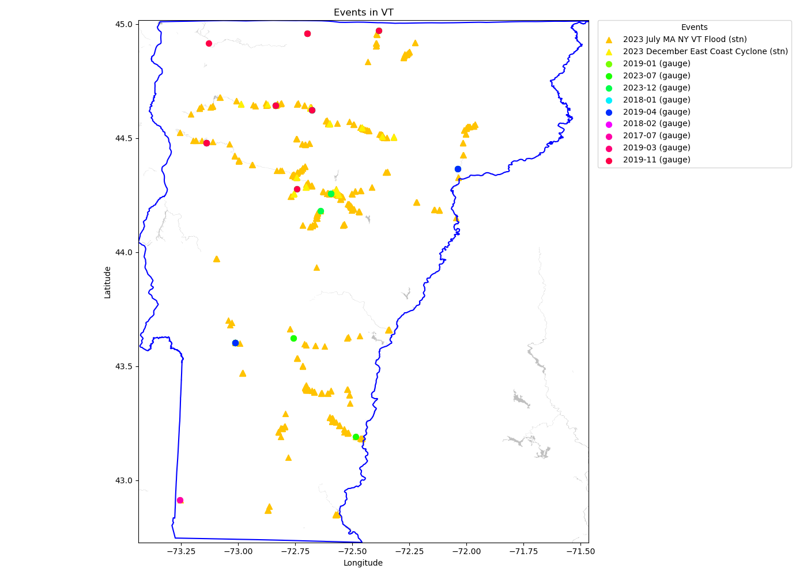

# Report
This document includes the analysis and discussion about flood event data and satellite imagery data.

## Flood Event Data

### STN
The cleaned STN flood event dataset has 889 instances. Below is an overview of the attributes in this dataset.
```
Number of Unique Values in Each Attribute:
 id           889
event          5
state          6
county        28
latitude     863
longitude    860
```

This dataset includes five unique events. They're `2018 January Extratropical Cyclone`, `2018 March Extratropical Cyclone`, `2021 Henri`,`2023 July MA NY VT Flood`, and `2023 December East Coast Cyclone`. Below is the number of flood events in each category. `2023 July MA NY VT Flood` has the largest number of flood events; therefore, the majority of the satellite images will probably belong to this event.
```
Flood Events Group By event:
                                     total_count
event
2023 July MA NY VT Flood                    641
2018 March Extratropical Cyclone            115
2018 January Extratropical Cyclone           81
2023 December East Coast Cyclone             43
2021 Henri                                    9
```

This dataset doesn't specify the exact dates of these flood event. However, to collect and distinguish the satellite imagery before/during/after flood events, it's necessary to obtain more accurate dates. Therefore, I explored online reports to define the dates and understand how the flood events affected the New England Region. Below is a table summarizing the information from the online reports.
<table>
    <tr>
        <td>
            [2018 January Extratropical Cyclone](https://en.wikipedia.org/wiki/January_2018_North_American_blizzard)
        </td>
        <td>
            <ul>
                <li>Date: 2018-01-02(formed) - 2018-01-06(dissipated)</li>
                <li>Impact: </li>
                <li>Affected State: </li>
            </ul>
        </td>
    </tr>
    <tr>
        <td>
            [2018 March Extratropical Cyclone](https://en.wikipedia.org/wiki/March_1%E2%80%933,_2018_nor%27easter)
        </td>
        <td>
            <ul>
                <li>Date: 2018-03-01(formed) - 2018-03-05(dissipated)</li>
                <li>Impact: </li>
                <li>Affected State: </li>
            </ul>
        </td>
    </tr>
    <tr>
        <td>
            [2021 Henri](https://www.nhc.noaa.gov/data/tcr/AL082021_Henri.pdf)
        </td>
        <td>
            <ul>
                <li>Date: 2021-08-15(formed) - 2021-08-23(dissipated)</li>
                <li>Impact: </li>
                <li>Affected State: </li>
            </ul>
        </td>
    </tr>
    <tr>
        <td>
            [2023 July MA NY VT Flood](https://www.weather.gov/btv/The-Great-Vermont-Flood-of-10-11-July-2023-Preliminary-Meteorological-Summary)
        </td>
        <td>
            <ul>
                <li>Date: 2023-07-10(formed) - 2023-07-11(dissipated)</li>
                <li>Impact: </li>
                <li>Affected State: </li>
            </ul>
        </td>
    </tr>
    <tr>
        <td>
            [2023 December East Coast Cyclone](https://cw3e.ucsd.edu/wp-content/uploads/2023/12/20Dec2023_Summary/20231218EastCoast.pdf)
        </td>
        <td>
            <ul>
                <li>Date: 2023-12-17(formed) - 2023-12-18(dissipated)</li>
                <li>Impact: </li>
                <li>Affected State: </li>
            </ul>
        </td>
    </tr>
 </table>

The figure below illustrates the distribution of STN flood events. Vermont (2023 July MA NY VT Flood) has the largest number of flood events.


### Gauge
In this project, I also collected the gauge water level data. Combining this dataset with STN dataset might help us better analyze and understand the flood events. Below is an overview of the cleaned dataset.
```
Number of Unique Values in Each Attribute:
 id           262
event         33
event_day    108
state          6
county        36
latitude      75
longitude     75
```

### STN and Gauge Overlap
I checked on the flood events documented by both sources. They are:
```
['2018-01' '2021-08' '2023-07' '2023-12']
```

The figure below illustrates the distribution of gauge flood events. Vermont (2023-07) has the largest number of flood events.


To understand the locations of flood events, I created a map for each state. Below is the flood events in Vermont.


## Satellite Imagery Data (Sentinel 2)